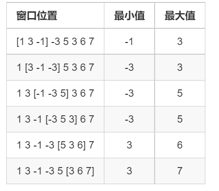

## 单调队列

单调队列是在队列的基础上，维护一个单调的序列。可以用来维护（给定大小的）区间的最值，其时间复杂度为o(n)，其中n为序列的元素个数。

---

## 经典问题

### 滑动窗口

<a href="https://www.acwing.com/problem/content/156/">题目链接</a>

**题目描述**

给定一个大小为 n≤106 的数组。

有一个大小为 k 的滑动窗口，它从数组的最左边移动到最右边。

你只能在窗口中看到 k 个数字。

每次滑动窗口向右移动一个位置。

以下是一个例子：

该数组为 [1 3 -1 -3 5 3 6 7]，k 为 3。



你的任务是确定滑动窗口位于每个位置时，窗口中的最大值和最小值。

**输入格式**

输入包含两行。

第一行包含两个整数 n 和 k，分别代表数组长度和滑动窗口的长度。

第二行有 n 个整数，代表数组的具体数值。

同行数据之间用空格隔开。

**输出格式**

输出包含两个。

第一行输出，从左至右，每个位置滑动窗口中的最小值。

第二行输出，从左至右，每个位置滑动窗口中的最大值。


**输入样例**

```
8 3
1 3 -1 -3 5 3 6 7
```

**输出样例**

```
-1 -3 -3 -3 3 3
3 3 5 5 6 7
```

### 题解

队列中维护长度为m的区间内数的最值

### 代码

```c++
#include<iostream>

using namespace std;

const int N = 1000010;
int a[N],q[N], n , k , hh = 0 , tt = -1;

int main()
{
    cin >> n >> k;
    for(int i = 0 ; i < n ; i ++ ) cin >> a[i];
    
    for(int i = 0 ; i < n ; i ++ )
    {
        while(hh <= tt && i - k + 1 > q[hh]) hh ++;
        while(hh<=tt && a[i] <= a[q[tt]]) tt--;
        q[++tt] = i ;
        if(i - k + 1 >= 0) cout << a[q[hh]] << " ";
    }
    cout<<endl;
    hh = 0 , tt = -1 ;
     for(int i = 0 ; i < n ; i ++ )
    {
        if(hh <= tt && i - k + 1 >q[hh]) hh ++;
        while(hh<=tt && a[i] >= a[q[tt]]) tt--;
        q[++tt] = i ;
        if(i - k + 1 >= 0) cout << a[q[hh]] << " ";
    }
    cout<<endl;
    
}
```

---

## 进阶问题

### 最大子序和

<a href="https://www.acwing.com/problem/content/137/">题目链接</a>

**题目描述**

输入一个长度为 n 的整数序列，从中找出一段长度不超过 m 的连续子序列，使得子序列中所有数的和最大。

**注意：** 子序列的长度至少是 1。

**输入格式**

第一行输入两个整数 n,m。

第二行输入 n 个数，代表长度为 n 的整数序列。

同一行数之间用空格隔开。

**输出格式**

输出一个整数，代表该序列的最大子序和。

**数据范围**
$1≤n,m≤300000$

**输入样例**

```
6 4
1 -3 5 1 -2 3
```

**输出样例**

```
7
```

### 题解

子序和很容易想到前缀和，$s[i]+s[i+1]...+s[j] = s[j] - s[i - 1]$，当我们遍历到第i个数时，最大子序和=$s[i]-min_{j-m<j<i}(s[j])$，发现是区间最值问题，于是可以用单调队列优化，队列中维护连续m个数中s[i]的最小值

### 代码

```c++
#include<bits/stdc++.h>
using namespace std;
const int N = 3e5 + 5;
int s[N];
int q[N], tt = -1, hh = 0;
int main() {
    int n, m;
    cin >> n >> m;
    for(int i = 1; i <= n; i ++ ) {
        cin >> s[i];
        s[i] += s[i - 1];
    }
    int res = -0x3f3f3f3f;
    q[++ tt] = 0;
    for(int i = 1; i <= n; i ++ ) {
        while(hh <= tt && i - q[hh] > m) hh ++ ;
        res = max(res, s[i] - s[q[hh]]);
        while(hh <= tt && s[i] <= s[q[tt]]) tt -- ;
        q[++ tt] = i; 
    }
    cout << res;
    return 0;
}
```

---

### 修剪草坪

<a href="https://www.acwing.com/problem/content/1089/">题目链接</a>

**题目描述**

在一年前赢得了小镇的最佳草坪比赛后，FJ 变得很懒，再也没有修剪过草坪。

现在，新一轮的最佳草坪比赛又开始了，FJ 希望能够再次夺冠。

然而，FJ 的草坪非常脏乱，因此，FJ 只能够让他的奶牛来完成这项工作。

FJ 有 N 只排成一排的奶牛，编号为 1 到 N。

每只奶牛的效率是不同的，奶牛 i 的效率为 Ei。

编号相邻的奶牛们很熟悉，如果 FJ 安排超过 K 只编号连续的奶牛，那么这些奶牛就会罢工去开派对。

因此，现在 FJ 需要你的帮助，找到最合理的安排方案并计算 FJ 可以得到的最大效率。

注意，方案需满足不能包含超过 K 只编号连续的奶牛。

**输入格式**

第一行：空格隔开的两个整数 N 和 K；

第二到 N+1 行：第 i+1 行有一个整数 Ei。

**输出格式**

共一行，包含一个数值，表示 FJ 可以得到的最大的效率值。

**数据范围**
$1≤N≤105,$
$0≤Ei≤109$

**输入样例**

```
5 2
1
2
3
4
5
```

**输出样例**

```
12
```

### 题解

令$f[i]$为到第i头牛为止合法的方案的效率最大值，若第i头不选，则$f[i]=f[i-1]$，若第i头牛选，我们以前一头空位置为最后一步，则$f[i]=max_{i-m \le j \lt i}(f[j-1]+s[i]-s[j])$，将常量$f[i]$提取，则$f[i]=s[i]+max_{i-m \le j \lt i}(f[j-1]-s[j])$，发现是区间最值，则用单调队列进行优化

### 代码

```c++
#include<bits/stdc++.h>
#define int long long
using namespace std;
const int N = 1e5 + 5;
int s[N];
int q[N], tt = -1, hh = 0; // 存长度不超过m的f[i - 1] - s[i]
int f[N];
int g(int x) {
    return f[x - 1] - s[x];
}
signed main() {
    int n, m;
    cin >> n >> m;
    for(int i = 1; i <= n; i ++ ) {
        cin >> s[i];
        s[i] += s[i - 1];
    }
    
    q[++ tt] = 0;
    for(int i = 1; i <= n; i ++ ) {
        while(hh <= tt && i - q[hh] > m) hh ++ ;
        f[i] = max(f[i - 1], g(q[hh]) + s[i]); 
        while(hh <= tt && g(i) >= g(q[tt])) tt -- ;
        q[++ tt] = i;
    }
    
    cout << f[n] << endl;
    return 0;
}
```

---

### 烽火传递

<a href="https://www.acwing.com/problem/content/1091/">题目链接</a>

**题目描述**

烽火台是重要的军事防御设施，一般建在交通要道或险要处。

一旦有军情发生，则白天用浓烟，晚上有火光传递军情。

在某两个城市之间有 n 座烽火台，每个烽火台发出信号都有一定的代价。

为了使情报准确传递，在连续 m 个烽火台中至少要有一个发出信号。

现在输入 n,m 和每个烽火台的代价，请计算在两城市之间准确传递情报所需花费的总代价最少为多少。

**输入格式**

第一行是两个整数 n,m，具体含义见题目描述；

第二行 n 个整数表示每个烽火台的代价 ai。

**输出格式**

输出仅一个整数，表示最小代价。

**数据范围**
$1≤m≤n≤2×105 ,$
$0≤ai≤1000$

**输入样例**

```
5 3
1 2 5 6 2
```

**输出样例**

```
4
```

### 题解

一个烽火台具有发出和不发出信号两种状态，考虑状态机，令$f[i][0]$表示第i个烽火台不发出信号的合法方案的最小代价，$f[i][1]$表示第i个烽火台发出信号，则状态转移如下：

+   $f[i][0] = min_{i - m \lt j \lt i}(f[j][1])$
+   $f[i][1] = min(f[i - 1][0], f[i - 1][1])$

则可以用单调队列维护$f[i][1]$的最小值

当然本题也可以用一维dp来做，令$f[i]$表示选择第i个烽火台发出信号的合法方案的最小价值，则

+   $f[i]=min_{i - m \le j \lt i}(f[j]) + w[i]$

同样用单调队列维护$f[i]$的最小值

### 代码

```c++
// 状态机版
#include<bits/stdc++.h>
using namespace std;
const int N = 2e5 + 5;
int f[N][2];
int w[N];
int q[N], tt = - 1, hh = 0;

int main() {
    int n, m;
    cin >> n >> m;
    for(int i = 1; i <= n; i ++ ) cin >> w[i];
    q[++ tt] = 0;
    for(int i = 1; i <= n; i ++ ) {
        while(hh <= tt && i - q[hh] >= m) hh ++ ;
        f[i][0] = f[q[hh]][1];

        f[i][1] = min(f[i - 1][0], f[i - 1][1]) + w[i];
        while(hh <= tt && f[i][1] <= f[q[tt]][1]) tt -- ;
        q[++ tt] = i;
    }

    cout << min(f[n][1], f[n][0]) << endl;
    return 0;
}

// 一维
#include<bits/stdc++.h>
using namespace std;
const int N = 2e5 + 5;
int f[N];
int w[N];
int q[N], tt = - 1, hh = 0;

int main() {
    int n, m;
    cin >> n >> m;
    for(int i = 1; i <= n; i ++ ) cin >> w[i];
    q[++ tt] = 0;
    for(int i = 1; i <= n; i ++ ) {
        while(hh <= tt && i - q[hh] > m) hh ++ ;
        f[i] = f[q[hh]] + w[i];
        while(hh <= tt && f[i] <= f[q[tt]]) tt -- ;
        q[++ tt] = i;
    }
    int res = 0x3f3f3f3f;
    for(int i = n - m + 1; i <= n; i ++ ) res = min(res, f[i]);
    cout << res;
    return 0;
}

```

--- 

### 绿色通道

<a href="https://www.acwing.com/problem/content/1092/">题目链接</a>

**题目描述**

高二数学《绿色通道》总共有 n 道题目要抄，编号 1,2,…,n，抄第 i 题要花 ai 分钟。

小 Y 决定只用不超过 t 分钟抄这个，因此必然有空着的题。

每道题要么不写，要么抄完，不能写一半。

下标连续的一些空题称为一个空题段，它的长度就是所包含的题目数。

这样应付自然会引起马老师的愤怒，最长的空题段越长，马老师越生气。

现在，小 Y 想知道他在这 t 分钟内写哪些题，才能够尽量减轻马老师的怒火。

由于小 Y 很聪明，你只要告诉他最长的空题段至少有多长就可以了，不需输出方案。

**输入格式**

第一行为两个整数 n,t。

第二行为 n 个整数，依次为 a1,a2,…,an。

**输出格式**

输出一个整数，表示最长的空题段至少有多长。

**数据范围**
$0<n≤5×104 ,$
$0<ai≤3000,$
$0<t≤108$

**输入样例**

```
17 11
6 4 5 2 5 3 4 5 2 3 4 5 2 3 6 3 5
```

**输出样例**

```
3
```


### 题解

至少，至多类似的题考虑二分，二分空题段的长度，然后考虑check函数，发现当最大空题段长度m确定后，本题可以转化为在连续m道题中至少抄一道题的合法方案所需最少时间是否在给定时间t内，将抄题和发信号对应，发现和烽火传递几乎一致，因此套用烽火传递的方法即可

### 代码

```c++
#include<bits/stdc++.h>
#define int long long
using namespace std;
const int N = 5e4 + 5;
int w[N];
int f[N][2];
int q[N], tt = -1, hh = 0;
int n, t;
bool check(int x) {
    f[0][1] = 0;
    f[0][0] = 0;
    tt = -1, hh = 0;
    q[++ tt] = 0;
    for(int i = 1; i <= n; i ++ ) {
        while(i - q[hh] > x) hh ++ ;
        f[i][0] = f[q[hh]][1];
        f[i][1] = min(f[i - 1][0], f[i - 1][1]) + w[i];
        while(hh <= tt && f[i][1] <= f[q[tt]][1]) tt -- ;
        q[++ tt] = i;
    }
    if(min(f[n][0], f[n][1]) > t) return false;
    return true;
}
signed main() {
    cin >> n >> t;
    int sum = 0;
    for(int i = 1; i <= n; i ++ ) {
        cin >> w[i];
        sum += w[i];
    }
    if(sum <= t) {
        cout << "0";
        return 0;
    }
    int l = 1, r = n;
    while(l < r) {
        int mid = l + r >> 1;
        if(check(mid)) r = mid;
        else l = mid + 1;
    }
    
    cout << r << endl;
    return 0;
}
```