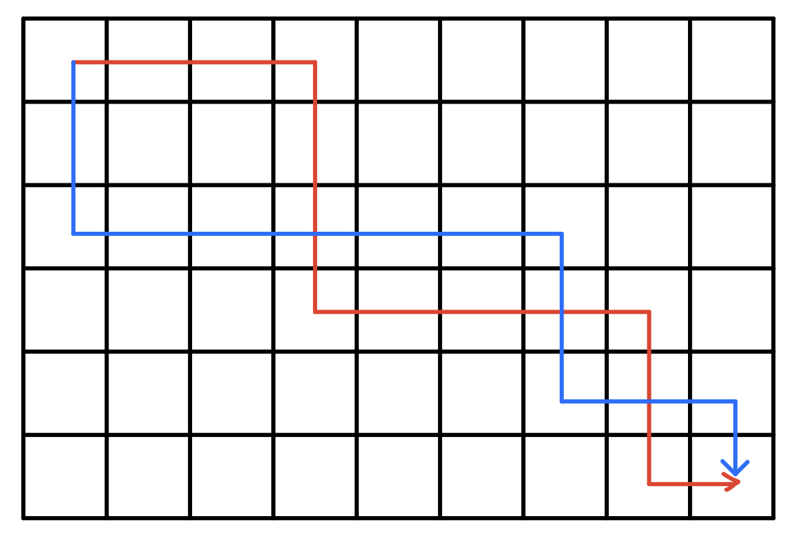
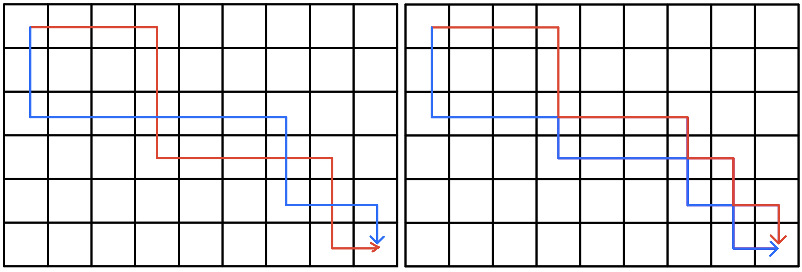
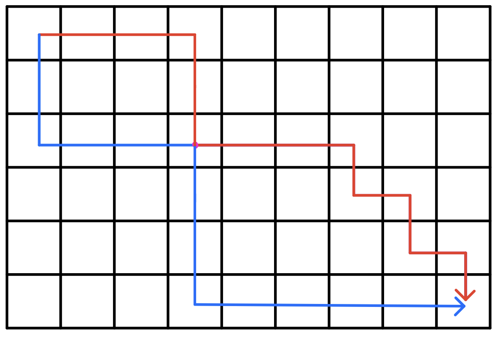
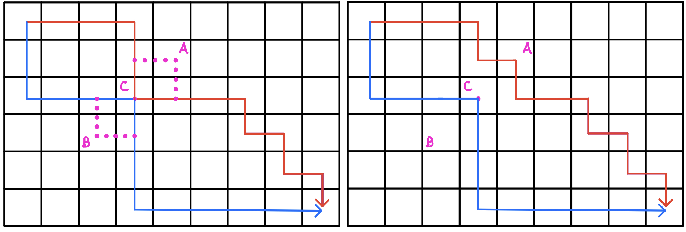

## 例1.摘花生

<a href="https://www.acwing.com/problem/content/1017/">题目链接</a>

**题目描述**

Hello Kitty想摘点花生送给她喜欢的米老鼠。

她来到一片有网格状道路的矩形花生地(如下图)，从西北角进去，东南角出来。

地里每个道路的交叉点上都有种着一株花生苗，上面有若干颗花生，经过一株花生苗就能摘走该它上面所有的花生。

Hello Kitty只能向东或向南走，不能向西或向北走。

问Hello Kitty最多能够摘到多少颗花生。


**输入格式**

第一行是一个整数T，代表一共有多少组数据。

接下来是T组数据。

每组数据的第一行是两个整数，分别代表花生苗的行数R和列数 C。

每组数据的接下来R行数据，从北向南依次描述每行花生苗的情况。每行数据有C个整数，按从西向东的顺序描述了该行每株花生苗上的花生数目M。

**输出格式**

对每组输入数据，输出一行，内容为Hello Kitty能摘到得最多的花生颗数。

**数据范围**

$1≤T≤100,$

$1≤R,C≤100,$

$0≤M≤1000$

**输入样例**

```
2
2 2
1 1
3 4
2 3
2 3 4
1 6 5
```

**输出样例**

```
8
16
```

### 思路

标准的动态规划题目,从以下三个角度来分析

+   状态表示:
    +   集合:定义$f[i,j]$表示从$(1,1)$到$(i,j)$的所有方案
    +   属性:最大值
+   状态转移:
    +   $(i,j)$从$(i-1,j)$转移过来,$f[i,j]=f[i-1,j]+a[i,j]$
    +   $(i,j)$从$(i,j-1)$转移过来,$f[i,j]=f[i,j-1]+a[i,j]$
+   优化
    +   由于$f[i][j]$只需要用到这一层和上一层的元素,因此可以用滚动数组优化空间

### 代码

```c++
#include<bits/stdc++.h>
using namespace std;
const int N = 1005;
int a[N][N],f[N][N];
int main()
{
    cin.tie(0);
    cout.tie(0);
    ios::sync_with_stdio(0);
    int t;
    cin>>t;
    while(t--)
    {
        int n,m;
        cin>>n>>m;
        memset(f,0,sizeof(f));
        for(int i=1;i<=n;i++)
            for(int j=1;j<=m;j++)
                cin>>a[i][j];
        for(int i=1;i<=n;i++)
            for(int j=1;j<=m;j++)
                f[i][j]=max(f[i-1][j],f[i][j-1])+a[i][j];
        cout<<f[n][m]<<endl;
    }
}
```

---

## 例2.最低通行费

<a href="https://www.acwing.com/problem/content/1020/">题目链接</a>

**题目描述**

一个商人穿过一个 $N×N$ 的正方形的网格，去参加一个非常重要的商务活动。

他要从网格的左上角进，右下角出。

每穿越中间$1$个小方格，都要花费$1$个单位时间。

商人必须在 $(2N−1)$ 个单位时间穿越出去。

而在经过中间的每个小方格时，都需要缴纳一定的费用。

这个商人期望在规定时间内用最少费用穿越出去。

请问至少需要多少费用？

注意：不能对角穿越各个小方格（即，只能向上下左右四个方向移动且不能离开网格）。

**输入格式**

第一行是一个整数，表示正方形的宽度$ N$。

后面$N$行，每行$ N $个不大于$ 100 $的正整数，为网格上每个小方格的费用。

**输出格式**

输出一个整数，表示至少需要的费用。

**数据范围**

$1≤N≤100$

**输入样例**

```
5
1  4  6  8  10
2  5  7  15 17
6  8  9  18 20
10 11 12 19 21
20 23 25 29 33
```

**输出样例**

```
109
```

### 题解

+   状态表示:
    +   集合:$f[i,j]$表示从起点出发,走到第$(i,j)$的所有方案
    +   属性:总价值最小
+   状态转移:
    +   $f[i,j]=min(f[i-1,j],f[i,j-1])+w[i,j]$

### 代码

```c++
#include <iostream>
#include <cstring>
#include <algorithm>

using namespace std;

const int N = 105;
int a[N][N],f[N][N];
int main()
{
    int n;
    cin>>n;
    for(int i=1;i<=n;i++)
        for(int j=1;j<=n;j++)
            cin>>a[i][j];
    memset(f,0x3f,sizeof(f));
    f[0][0]=f[0][1]=f[1][0]=0;
    for(int i=1;i<=n;i++)
        for(int j=1;j<=n;j++)
            f[i][j]=min(f[i-1][j],f[i][j-1])+a[i][j];
    cout<<f[n][n]<<endl;
    return 0;
}
```

---

## 例3.方格取数

<a href="https://www.acwing.com/problem/content/1029/">题目链接</a>

**题目描述**

设有 N×N 的方格图，我们在其中的某些方格中填入正整数，而其它的方格中则放入数字0。如下图所示：


某人从图中的左上角 A 出发，可以向下行走，也可以向右行走，直到到达右下角的 B 点。

在走过的路上，他可以取走方格中的数（取走后的方格中将变为数字0）。

此人从 A 点到 B 点共走了两次，试找出两条这样的路径，使得取得的数字和为最大。


**输入格式**

第一行为一个整数N，表示 N×N 的方格图。

接下来的每行有三个整数，第一个为行号数，第二个为列号数，第三个为在该行、该列上所放的数。

行和列编号从 1 开始。

一行“0 0 0”表示结束。

**输出格式**

输出一个整数，表示两条路径上取得的最大的和。

**数据范围**

$N≤10$

**输入样例**

```
8
2 3 13
2 6 6
3 5 7
4 4 14
5 2 21
5 6 4
6 3 15
7 2 14
0 0 0
```

**输出样例**

```
67
```

### 题解

刚开始看到这道题，正常思路应该是用开四维DP，$f[x1,y1,x2,y2]$表示两条路线走到的位置，可由于题目给出一个格子的贡献无法重复计算，因此还需要增加一维来表示每个格子是否被取过，但这样显然时间空间都爆炸，因此考虑其他方法

虽然题目要求先后出发，但实际上不管是先后出发还是同时出发，一个格子的贡献都只能被算一次，而我们若选择同时出发的话，可以发现两条路线的曼哈顿距离是相等的，这样可以通过三维状态表示两个点的位置，继续从以下表示和转移两个角度考虑:

+   状态表示:
    +   属性:$f[k,i,j]$表示路径长度为k,第一条路径的x坐标为i,第二条路径的x坐标为j的所有方案
    +   集合:总价值最大
+   状态转移:
    +   $f[k,i,j]=max(f[k-1,i,j],f[k-1,i-1,j],f[k-1,i,j-1],f[k-1][i-1][j-1])+w[i,j]$

### 代码

```c++
#include<bits/stdc++.h>
using namespace std;

const int N = 15;
int a[N][N],f[2*N][N][N];

int main()
{
    int n;
    cin>>n;
    int x,y,z;
    while(cin>>x>>y>>z)
    {
        a[x][y]=z;
        if(!x&&!y&&!z) break;
    }
    for(int k=2;k<=2*n;k++)
    {
        for(int i1=1;i1<=n;i1++)
        {
            for(int i2=1;i2<=n;i2++)
            {
                int j1=k-i1,j2=k-i2;
                if(j1<1||j2<1||j1>n||j2>n) continue;
                int v;
                if(i1==i2&&j1==j2) v=a[i1][j1];
                else v=a[i1][j1]+a[i2][j2];
                f[k][i1][i2]=max(f[k-1][i1-1][i2-1]+v,f[k][i1][i2]);
                f[k][i1][i2]=max(f[k-1][i1-1][i2]+v,f[k][i1][i2]);
                f[k][i1][i2]=max(f[k-1][i1][i2-1]+v,f[k][i1][i2]);
                f[k][i1][i2]=max(f[k-1][i1][i2]+v,f[k][i1][i2]);
            }
        }
    }
    
    cout<<f[2*n][n][n]<<endl;
    return 0;
}
```

---

## 例4.传纸条

<a href="https://www.acwing.com/problem/content/277/">题目链接</a>

**题目描述**

小渊和小轩是好朋友也是同班同学，他们在一起总有谈不完的话题。

一次素质拓展活动中，班上同学安排坐成一个 m 行 n 列的矩阵，而小渊和小轩被安排在矩阵对角线的两端，因此，他们就无法直接交谈了。

幸运的是，他们可以通过传纸条来进行交流。

纸条要经由许多同学传到对方手里，小渊坐在矩阵的左上角，坐标 (1,1)，小轩坐在矩阵的右下角，坐标 (m,n)。

从小渊传到小轩的纸条只可以向下或者向右传递，从小轩传给小渊的纸条只可以向上或者向左传递。 

在活动进行中，小渊希望给小轩传递一张纸条，同时希望小轩给他回复。

班里每个同学都可以帮他们传递，但只会帮他们一次，也就是说如果此人在小渊递给小轩纸条的时候帮忙，那么在小轩递给小渊的时候就不会再帮忙，反之亦然。 

还有一件事情需要注意，全班每个同学愿意帮忙的好感度有高有低（注意：小渊和小轩的好心程度没有定义，输入时用 0 表示），可以用一个 0∼100 的自然数来表示，数越大表示越好心。

小渊和小轩希望尽可能找好心程度高的同学来帮忙传纸条，即找到来回两条传递路径，使得这两条路径上同学的好心程度之和最大。

现在，请你帮助小渊和小轩找到这样的两条路径。

**输入格式**

第一行有 2 个用空格隔开的整数 m 和 n，表示学生矩阵有 m 行 n 列。

接下来的 m 行是一个 m×n 的矩阵，矩阵中第 i 行 j 列的整数表示坐在第 i 行 j 列的学生的好心程度，每行的 n 个整数之间用空格隔开。

**输出格式**

输出一个整数，表示来回两条路上参与传递纸条的学生的好心程度之和的最大值。

**数据范围**

$1≤n,m≤50$

**输入样例**

```
3 3
0 3 9
2 8 5
5 7 0
```

**输出样例**

```
34
```

### 题解

由于从$(n,m)$点通过向上向左走到$(1,1)$，等同于从$(1,1)$点通过向下向右走到$(n,m)$

因此本题就转化为:

从$(1,1)$出发到达$(n,m)$，且每次只能向下或向右，先后出发两次，且两次不能通过重复格子的方案数

与上一题方格取数很相似，但规定了不能走重复格子

接下来我们给出一个结论:

方格取数中最优方案两条路径一定不走重复格子

接下来给出证明:

**情况1:** 最优解的两条路径是相互交叉经过的



则我们可以对交叉部分进行路径交换



这样就得到了不交叉的路线

因此对于每一种交叉路径，都必然有一条不交叉路径与其对应

**情况2:** 最优解的两条路径不交叉，但在某些点重合



这种情况我们可以对其继续微调，如下图



我们一定可以找到额外的一条路径，使其不通过重复点

因此得证

经过以上证明，我们发现这题和上题一模一样，具体状态定义和转移见上题

### 代码

```c++
#include<bits/stdc++.h>
using namespace std;

const int N = 55;
int a[N][N],f[2*N][N][N];

int main()
{
    int n,m;
    cin>>n>>m;
    for(int i=1;i<=n;i++)
        for(int j=1;j<=m;j++)
            cin>>a[i][j];
    for(int k=2;k<=n+m;k++)
    {
        for(int i1=1;i1<=n;i1++)
        {
            for(int i2=1;i2<=n;i2++)
            {
                int j1=k-i1,j2=k-i2;
                if(j1<1||j2<1||j1>m||j2>m) continue;
                int v;
                if(i1==i2&&j1==j2) v=a[i1][j1];
                else v=a[i1][j1]+a[i2][j2];
                f[k][i1][i2]=max(f[k-1][i1-1][i2-1]+v,f[k][i1][i2]);
                f[k][i1][i2]=max(f[k-1][i1-1][i2]+v,f[k][i1][i2]);
                f[k][i1][i2]=max(f[k-1][i1][i2-1]+v,f[k][i1][i2]);
                f[k][i1][i2]=max(f[k-1][i1][i2]+v,f[k][i1][i2]);
            }
        }
    }
    
    cout<<f[n+m][n][n]<<endl;
    return 0;
}
```
