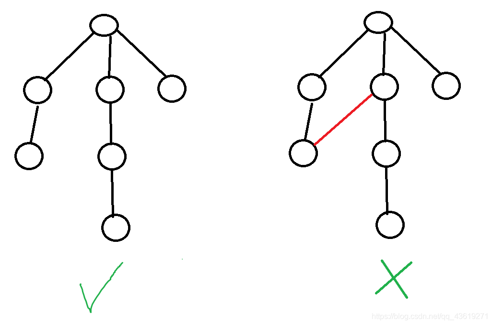

## 树的概念

如果一个无向连通图不包含回路(连通图中不存在环),那么就是一个树。

如下图:



---


## 概述

对于一个有$n$个点的图，边数一定是大于等于$n-1$条的。图的最小生成树，就是在这些边中选出$n-1$条，使其连接所有的$n$个点，并且边权之和最小。

解决此类问题常见有两种算法

+   kruskal算法
+   prim算法

接下来分别讲解

## kruskal算法

### 操作步骤

    将边按照边权从小到大排序，并建立一个没有边的图T。
    选出一条没有被选过的边权最小的边。
    如果这条边两个顶点在T中所在的连通块不相同，那么将它加入图T，相同就跳过。
    重复步骤2和步骤3直到图T连通为止。

!!! note
    联通块的判断与添加需要借助并查集相关知识，可以👉转<a href="https://wiki.fyqcode.top/ACM/%E6%95%B0%E6%8D%AE%E7%BB%93%E6%9E%84/%E5%B9%B6%E6%9F%A5%E9%9B%86%20%E5%9F%BA%E7%A1%80%E7%AF%87/">并查集</a>

---

## prim 算法

### 操作步骤

    先建立一个只有一个结点的树，这个结点可以是原图中任意的一个结点
    使用一条边扩展这个树，要求这条边一个顶点在树中另一 个顶点不在树中，并且这条边的权值要求最小。
    重复步骤2直到所有顶点都在树中。

!!! note
    这里的扩展和最短路djikstra的松弛操作不一样

---

## 例1.Kruskal算法求最小生成树

### 题目描述

给定一个 n 个点 m 条边的无向图，图中可能存在重边和自环，边权可能为负数。

求最小生成树的树边权重之和，如果最小生成树不存在则输出 impossible。

给定一张边带权的无向图 G=(V,E)，其中 V 表示图中点的集合，E 表示图中边的集合，n=|V|，m=|E|。

由 V 中的全部 n 个顶点和 E 中 n−1 条边构成的无向连通子图被称为 G 的一棵生成树，其中边的权值之和最小的生成树被称为无向图 G 的最小生成树。

**输入格式**

第一行包含两个整数 n 和 m。

接下来 m 行，每行包含三个整数 u,v,w，表示点 u 和点 v 之间存在一条权值为 w 的边。

**输出格式**

共一行，若存在最小生成树，则输出一个整数，表示最小生成树的树边权重之和，如果最小生成树不存在则输出 `impossible`。

**数据范围**

$1≤n≤10^5,$

$1≤m≤2∗10^5,$

图中涉及边的边权的绝对值均不超过 1000。

**输入样例**

```
4 5
1 2 1
1 3 2
1 4 3
2 3 2
3 4 4
```

**输出样例**

```
6
```

### 代码

```c++
#include<bits/stdc++.h>
using namespace std;
const int N = 1e5 + 5, M = 2e5 + 5;
struct node_ {
    int s, t;
    int dis;
    friend bool operator < (const node_ a, const node_ b) {
        return a.dis < b.dis;
    }
}node[M];
int pre[N];
inline int find(int x) {
    return x == pre[x] ? x : pre[x] = find(pre[x]);
}
int main() {
    int n, m;
    cin >> n >> m;
    for(int i = 1; i <= n; i ++ ) pre[i] = i;
    for(int i = 1; i <= m; i ++ ) {
        cin >> node[i].s >> node[i].t >> node[i].dis;
    }
    sort(node + 1, node + m + 1);
    int sum = 0;
    int cnt = 0;
    for(int i = 1; i <= m; i ++ ) {
        int x = node[i].s;
        int y = node[i].t;
        int fx = find(x);
        int fy = find(y);
        if(fx != fy) {
            pre[fx] = fy;
            cnt ++ ;
            sum += node[i].dis;
        }
    }
    if(cnt == n - 1) 
    cout << sum << '\n';
    else cout << "impossible";
    return 0;
}
```

---

## 例2.Prim算法求最小生成树

<a href="https://www.acwing.com/problem/content/860/">题目链接</a>

### 题目描述

给定一个 n 个点 m 条边的无向图，图中可能存在重边和自环，边权可能为负数。

求最小生成树的树边权重之和，如果最小生成树不存在则输出 impossible。

给定一张边带权的无向图 G=(V,E)，其中 V 表示图中点的集合，E 表示图中边的集合，n=|V|，m=|E|。

由 V 中的全部 n 个顶点和 E 中 n−1 条边构成的无向连通子图被称为 G 的一棵生成树，其中边的权值之和最小的生成树被称为无向图 G 的最小生成树。

**输入格式**

第一行包含两个整数 n 和 m。

接下来 m 行，每行包含三个整数 u,v,w，表示点 u 和点 v 之间存在一条权值为 w 的边。

**输出格式**

共一行，若存在最小生成树，则输出一个整数，表示最小生成树的树边权重之和，如果最小生成树不存在则输出 `impossible`。

**数据范围**

$1≤n≤500,$

$1≤m≤10^5,$

图中涉及边的边权的绝对值均不超过 10000。

**输入样例**

```
4 5
1 2 1
1 3 2
1 4 3
2 3 2
3 4 4
```

**输出样例**

```
6
```

### 代码

```c++
#include<bits/stdc++.h>
using namespace std;
const int N=505,M=2e5+5;
int head[N],e[M],w[M],ne[M],idx=0;
int dis[N];
bool vis[N];
int n,m;
void add(int a,int b,int c)
{
    e[idx]=b;
    w[idx]=c;
    ne[idx]=head[a];
    head[a]=idx++;
}
void prim()
{
    memset(dis,0x3f,sizeof(dis));
    dis[1]=0;
    int res=0;
    for(int i=1;i<=n;i++)
    {
        int pos=-1;
        for(int j=1;j<=n;j++)
        {
            if(!vis[j]&&(pos==-1||dis[pos]>dis[j])) pos=j;
        }
        if(dis[pos]==0x3f3f3f3f)
        {
            cout<<"impossible"<<endl;
            return ;
        }
        res+=dis[pos];
        vis[pos]=true;
        for(int j=head[pos];j!=-1;j=ne[j])
        {
            int ta=e[j];
            dis[ta]=min(dis[ta],w[j]);
        }
    }
    cout<<res;
}
int main()
{
    memset(head,-1,sizeof(head));
    cin>>n>>m;
    for(int i=1;i<=m;i++)
    {
        int a,b,c;
        cin>>a>>b>>c;
        add(a,b,c);
        add(b,a,c);
    }
    prim();
    return 0;
}
```

---

## 例3.最短网络

<a href="https://www.acwing.com/problem/content/1142/">题目链接</a>

### 题目描述

农夫约翰被选为他们镇的镇长！

他其中一个竞选承诺就是在镇上建立起互联网，并连接到所有的农场。

约翰已经给他的农场安排了一条高速的网络线路，他想把这条线路共享给其他农场。

约翰的农场的编号是1，其他农场的编号是 2∼n。

为了使花费最少，他希望用于连接所有的农场的光纤总长度尽可能短。

你将得到一份各农场之间连接距离的列表，你必须找出能连接所有农场并使所用光纤最短的方案。

**输入格式**

第一行包含一个整数 n，表示农场个数。

接下来 n 行，每行包含 n 个整数，输入一个对角线上全是0的对称矩阵。
其中第 x+1 行 y 列的整数表示连接农场 x 和农场 y 所需要的光纤长度。

**输出格式**

输出一个整数，表示所需的最小光纤长度。

**数据范围**

$3≤n≤100$

每两个农场间的距离均是非负整数且不超过$100000$。

**输入样例**

```
4
0  4  9  21
4  0  8  17
9  8  0  16
21 17 16  0
```

**输出样例**

```
28
```

### 题解

完全图下的最小生成树，发现数据范围很小，直接无脑kruskal算法即可

### 代码

```c++
#include<bits/stdc++.h>
using namespace std;
const int N=1e4+5;
struct node_
{
    int from,to;
    int dis;
    friend bool operator < (const node_ x,const node_ y)
    {
        return x.dis < y.dis;
    }
}node[N];
int pre[105];
int find(int x)
{
    return x == pre[x] ? x : pre[x] = find(pre[x]);
}

void init(int n)
{
    for(int i=1;i<=n;i++) pre[i]=i;
}
int main()
{
    int n;
    cin>>n;
    int cnt = 0;
    init(n);
    for(int i=1;i<=n;i++)
    {
        for(int j=1;j<=n;j++)
        {
            int a;
            cin>>a;
            if (i >= j) continue;
            node[++cnt] = {i, j, a};
        }
    }
    sort(node+1,node+cnt+1);
    int res=0;
    for(int i = 1; i <= cnt; i ++ )
    {
        int a = node[i].from;
        int b = node[i].to;
        int fx = find(a);
        int fy = find(b);
        if (fx != fy)
        {
            pre[fx] =fy;
            res += node[i].dis;
        }
    }
    cout<<res<<endl;
    return 0;
}
```

---

## 例4.繁忙的都市

<a href="https://www.acwing.com/problem/content/1144/">题目链接</a>

### 题目描述

城市C是一个非常繁忙的大都市，城市中的道路十分的拥挤，于是市长决定对其中的道路进行改造。

城市C的道路是这样分布的：

城市中有 n 个交叉路口，编号是 1∼n，有些交叉路口之间有道路相连，两个交叉路口之间最多有一条道路相连接。

这些道路是 双向 的，且把所有的交叉路口直接或间接的连接起来了。

每条道路都有一个分值，分值越小表示这个道路越繁忙，越需要进行改造。

但是市政府的资金有限，市长希望进行改造的道路越少越好，于是他提出下面的要求：

1．改造的那些道路能够把所有的交叉路口直接或间接的连通起来。

2．在满足要求1的情况下，改造的道路尽量少。

3．在满足要求1、2的情况下，改造的那些道路中分值最大值尽量小。

作为市规划局的你，应当作出最佳的决策，选择哪些道路应当被修建。

**输入格式**

第一行有两个整数 n,m 表示城市有 n 个交叉路口，m 条道路。

接下来 m 行是对每条道路的描述，每行包含三个整数u,v,c 表示交叉路口 u 和 v 之间有道路相连，分值为 c。

**输出格式**

两个整数 s,max，表示你选出了几条道路，分值最大的那条道路的分值是多少。

**数据范围**

$1≤n≤300,$

$1≤m≤8000,$

$1≤c≤10000$

**输入样例**

```
4 5
1 2 3
1 4 5
2 4 7
2 3 6
3 4 8
```

**输出样例**

```
3 6
```

### 题解

第一个和第二个要求告诉我们这是个最小生成树，第三个要求让我们求最小生成树的最大边权，本题使用prim算法来写

### 代码

```c++
#include<bits/stdc++.h>
using namespace std;
const int N=305,M=16005;
int head[N],e[M],w[M],ne[M],idx=0;
void add(int a,int b,int c)
{
    e[idx] = b;
    w[idx] = c;
    ne[idx] = head[a];
    head[a] = idx ++;
}
int dis[N];
bool vis[N];
int maxx[N];
int n,m;
void prim()
{
    memset(dis,0x3f,sizeof(dis));
    dis[1] = 0;
    int res = -1;
    int sum = 0;
    for(int i=1;i<=n;i++)
    {
        int pos = -1;
        for(int j=1;j<=n;j++)
        {
            if(!vis[j]&&(pos==-1||dis[j]<dis[pos])) pos=j;
        }
        if(dis[pos] == 0x3f3f3f3f) 
        {
            cout<<"-1"<<endl;
            return ;
        }
        vis[pos] = true;
        sum ++;
        res = max(res, dis[pos]);
        for(int k=head[pos];k!=-1;k=ne[k])
        {
            int j=e[k];
            dis[j] = min(dis[j], w[k]);
        }
    }
    cout<<sum - 1<<" "<<res<<endl;
}
int main()
{
    cin>>n>>m;
    memset(head,-1,sizeof(head));
    for(int i=1;i<=m;i++)
    {
        int a,b,c;
        cin>>a>>b>>c;
        add(a,b,c);
        add(b,a,c);
    }
    prim();
    return 0;
}
```

---

## 例5.连接格点

<a href="https://www.acwing.com/problem/content/1146/">题目链接</a>

### 题目描述

有一个 m 行 n 列的点阵，相邻两点可以相连。

一条纵向的连线花费一个单位，一条横向的连线花费两个单位。

某些点之间已经有连线了，试问至少还需要花费多少个单位才能使所有的点全部连通。

**输入格式**

第一行输入两个正整数 m 和 n。

以下若干行每行四个正整数 x1,y1,x2,y2，表示第 x1 行第 y1 列的点和第 x2 行第 y2 列的点已经有连线。

输入保证|x1−x2|+|y1−y2|=1。

**输出格式**

输出使得连通所有点还需要的最小花费。

**数据范围**

$1≤m,n≤1000$

$0≤已经存在的连线数≤10000$

**输入样例**

```
2 2
1 1 2 1
```

**输出样例**

```
3
```

### 题解

完全图的最小生成树，数据范围只有1000，可以存下所有的边，然后跑kruskal或者prim都行

### 代码

```c++
#include<bits/stdc++.h>
using namespace std;
const int N=2e6+5;
struct node_
{
    int a,b;
    int dis;
    friend bool operator < (const node_ x,const node_ y)
    {
        return x.dis < y.dis;
    }
}node[N];
int pre[N];
int find(int x)
{
    return x == pre[x] ? x : pre[x] = find(pre[x]);
}
int g[1005][1005];
int t = 0;
int dir[4][2] = {0,1,1,0};
void init(int n,int m)
{
    int cnt=1;
    for(int i=1;i<=n*m;i++) pre[i] = i;
    for(int i=1;i<=n;i++)
    {
        for(int j=1;j<=m;j++)
        {
            g[i][j] = cnt++;
        }
    }
    for(int i=1;i<=n;i++)
    {
        for(int j=1;j<=m;j++)
        {
            for(int k=0;k<=1;k++)
            {
                int a = i + dir[k][0];
                int b = j + dir[k][1];
                if (a < 1 || b < 1 || a > n || b > m) continue;
                if (k == 0)
                    node[++t] = {g[i][j], g[a][b], 2};
                else node[++t] = {g[i][j], g[a][b], 1};
            }
        }
    }
}
int main()
{
    int n,m;
    cin>>n>>m;
    int x1,y1,x2,y2;
    init(n,m);
    while(cin>>x1>>y1>>x2>>y2)
    {
        int a = g[x1][y1];
        int b = g[x2][y2];
        int fx = find(a);
        int fy = find(b);
        pre[fx] = fy;
    }
    sort(node+1,node+1+t);
    int res = 0;
    for(int i=1;i<=t;i++)
    {
        int fx = find(node[i].a);
        int fy = find(node[i].b);
        if(fx != fy)
        {
            pre[fx] = fy;
            res += node[i].dis;
        }
    }
    cout<<res<<endl;
    return 0;
}
```


