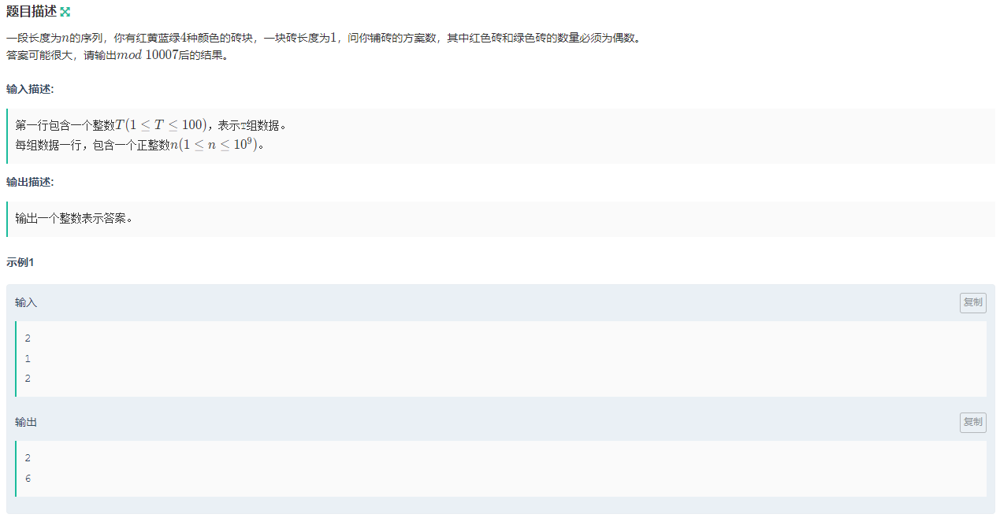

## 概述

指数型生成函数适用于解决多重集选择排列问题。

序列$a_n$定义为形式幂级数有以下形式:

$$F(x)=\sum a_n\frac{x^n}{n!}$$

---

## 应用

通常解决以下问题:

多重集种有$n$种不同元素，每种有$a_1,a_2...a_n$个，求从中选$m$个并排列的方案数

这里给出几个常用替换式:

+   $\sum_{i\ge0}\frac{x^n}{n!}=e^x$
+   $1+\frac{x^2}{2!}+\frac{x^4}{4!}=\frac{e^x+e^{-x}}{2}$

---

## 例题

### Blocks

<a href="https://ac.nowcoder.com/acm/contest/24710/D">题目链接</a>



### 题解

构造出红、绿砖的指数生成函数$F(x)=1+\frac{x^2}{2!}+\frac{x^4}{4!}...=\frac{e^x+e^{-x}}{2}$

黄、蓝砖的指数生成函数$G(x)=1+x+\frac{x^2}{2!}+\frac{x^3}{3!}...=e^x$

则$H(x)=F^2(x)G^2(x)=\frac{e^{4x}+2e^{2e} + 1}{4}=\frac{1}{4}\sum_{n\ge0}\frac{(4x)^n+2(2n)^n}{n!}x^n+\frac{1}{4}$为答案的指数生成函数

因此结果为$n![x^n]H(x)=n!\frac{1}{4}(\frac{4^n+2^{n+1}}{n!})=4^{n-1}+2^{n-1}$

### 代码

```c++
#include<bits/stdc++.h>
using namespace std;
const int mod = 10007;
int qpow(int a, int n, int mod) {
    int res = 1;
    while(n) {
        if(n & 1) res = res * a % mod;
        a = a * a % mod;
        n >>= 1;
    }
    return res;
}
int main() {
    int t;
    cin >> t;
    while(t -- ) {
        int n;
        cin >> n;
        cout << (qpow(4, n - 1, mod) + qpow(2, n - 1, mod)) % mod << endl;
    }
    return 0;
}
```
