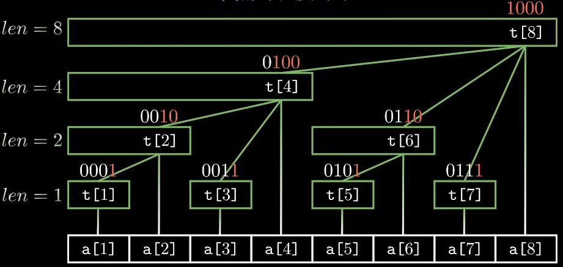

## 前置知识

+   获取最低位$1$

```c++
int lowbit(int x)
{
    return x & -x;
}
```

## 概述

树状数组，是一种小巧优雅的数据结构，可在 $O(logn)$ 的时间内计算出数列的前缀和

### 朴素算法

+   单点修改：$O(1)$
+   区间查询：$O(n)$

### 树状数组

+   单点修改：$O(logn)$
+   区间查询：$O(logn)$

树状数组的经典实现包含两个数组：一个是存储数列元素的数组 $a$，另一个是存储数列前缀和的数组 $t$

两个数组之间的关系为：$t[i]=a[i-2^k+1]+a[i-2^k+2]+…+a[i]$

其中的 $k$ 表示 $i$ 的二进制表示末尾有$k$个连续的 $0$

!!! note
    有$k$个$0$则说明$t[k]$表示$2^k$个数的和

以$t[8]$为例：$t[8]=a[1]+a[2]+a[3]+a[4]+a[5]+a[6]+a[7]+a[8](1000后面3个0,因此表示8个数的和)$

图示如下:



---

## 查询

对于查询前$m$个数的前缀和$a_1+a_2+a_3...+a_m$

$Sum_m$与$t$数组的关系如下：

以$m=7$为例

+   $sum_7=t_7+t_6+t_4$

$7$的二进制为$0111$，每次去除末尾的$1$

则二进制由$0111->0110->0100$

分别对应$7,6,4$

通过每次减去最低位的$1$，就可以查询到所需要的前缀和


---

## 维护前缀和

### 更新

+   将第$x$个数加上$c$

```c++
void add(int x, int c)
{
    for (int i = x; i <= n; i += lowbit(i)) tr[i] += c;
}
```

### 查询

```c++
int sum(int x)
{
    int res = 0;
    for (int i = x; i; i -= lowbit(i)) res += tr[i];
    return res;
}
```

---

## 维护最值

### 更新

```c++
void update(int p, int v) {
    a[p] = v;
    for(int i = p; i <= n; i += (i & -i) ) {
        int len = (i & -i);
        maxx[p] = a[p];
 
        for(int j = 1; j < len; j <<= 1) {
            maxx[p] = max(maxx[p], maxx[p - j]);
        }
 
        p += len;
    }
}
```

### 查询

```c++
int find(int l, int r) {
    int res = 0;
    while(l <= r) {
        res = max(res, a[r]);
        for(r = r - 1; r - (r & -r) >= l; r -= (r & -r)) {
            res = max(res, maxx[r]);
        }
    }
    return res;
}
```


