[论文地址](../source/等几何拓扑优化.pdf)
# IGA拓扑优化

## 一、概述

传统拓扑优化（如基于有限元方法）在结构建模与优化间存在割裂问题，几何建模依赖 CAD，而分析依赖 FEM，这种 几何与分析的不一致性 会引发误差积累与建模复杂性。为解决这一问题，论文引入 等几何分析（IGA），将 CAD 中常用的 NURBS（非均匀有理 B 样条）曲线直接用于分析建模，实现建模与分析的统一。

本论文基于 MATLAB 编写了一个轻量、紧凑、高效的 2D 等几何拓扑优化工具 `IgaTop`

---
## 二、模块介绍
| 模块名         | 功能说明                              |
|----------------|---------------------------------------|
| `Pre_IGA`      | 控制点序列构造、自由度编号            |
| `Geom_Mod`     | 结构几何建模，生成 NURBS 模型         |
| `Boun_Cond`    | 设置 Dirichlet 和 Neumann 边界        |
| `Assemble`     | 组装全局刚度矩阵                      |
| `FEA`          | 结构有限元求解                        |
| `Sensitivity`  | 灵敏度分析                            |
| `Filter`       | 应用灵敏度过滤                        |
| `Optimization` | 使用 MMA（移动渐近线）优化迭代        |

---
## 三、论文解读
$$
\text{Find: } \rho_{i,j} \quad (i=1,2,\dots,n;\ j=1,2,\dots,m)
$$

$$
\text{Min: } J(\mathbf{u}, \mathcal{X}) = \frac{1}{2} \int_{\Omega} \boldsymbol{\varepsilon}(\mathbf{u})^T\, \mathbf{D}(\mathcal{X}(\xi, \eta))\, \boldsymbol{\varepsilon}(\mathbf{u})\, d\Omega
$$

$$
\text{s.t. } 
\begin{cases}
G(\mathcal{X}) = \frac{1}{|\Omega|} \int_\Omega \mathcal{X}(\xi, \eta)\, v_0\, d\Omega - V_{\text{max}} \leq 0 & \text{（体积约束）} \\
a(\mathbf{u}, \delta \mathbf{u}) = l(\delta \mathbf{u}),\quad \mathbf{u}|_{\Gamma_D} = \mathbf{g},\ \forall\, \delta \mathbf{u} \in H^1(\Omega) & \text{（平衡方程）} \\
0 \leq \rho_{i,j} \leq 1 & \text{（设计变量约束）}
\end{cases}
$$

以上为论文中提到的ITO的数学表示模型，表达一个典型的基于密度的最小柔度问题
其中

*  $ρ_{i,j}$表示设计变量
* $J(\mathbf{u}, \mathcal{X}) = \dfrac{1}{2} \int_\Omega \boldsymbol{\varepsilon}(\mathbf{u})^T \mathbf{D}(\mathcal{X}(\xi,\eta)) \boldsymbol{\varepsilon}(\mathbf{u})\, d\Omega \\\\[1.2ex]$表示目标函数
    * u：位移场 $\epsilon$：应变
    * D：弹性刚度矩阵，与密度函数 $\mathcal{X}$有关
* $G(\mathcal{X}) = \frac{1}{|\Omega|} \int_\Omega \mathcal{X}(\xi,\eta)\, v_0 \, d\Omega - V_{\text{max}} \leq 0$
    * 表示体积约束，限制材料总体积不超过某个阈值$V_{max}$
* $a(\mathbf{u}, \delta \mathbf{u}) = l(\delta \mathbf{u}),\ \mathbf{u}|_{\Gamma_D} = \mathbf{g},\ \forall\, \delta \mathbf{u} \in H^1(\Omega)$
    * 对应结构的弱形式平衡方程（虚功原理）
    * $\Gamma_D$：Dirichlet 边界，施加位移条件
* 最后一个为设计变量约束

**母空间**

母空间是指一个标准区间，例如：

* 1D：[-1,1]
* 2D：[-1,1] $\times$ [-1,1]

**参数空间**

定义Nurbs基函数变量的标准空间

**物理空间**

将 NURBS 基函数定义的“参数空间”映射到结构所在的实际物理空间。使用 NURBS 基函数对参数空间点进行加权组合，实现曲线/面的光滑表达：$\mathbf{x}(\xi, \eta) = \sum_i R_i(\xi, \eta)\, \mathbf{P}_i$

在计算刚度矩阵时，需要使用到高斯积分，这被定义到母空间 

​IGA需要使用两个映射：
母空间 → 参数空间 → 物理空间
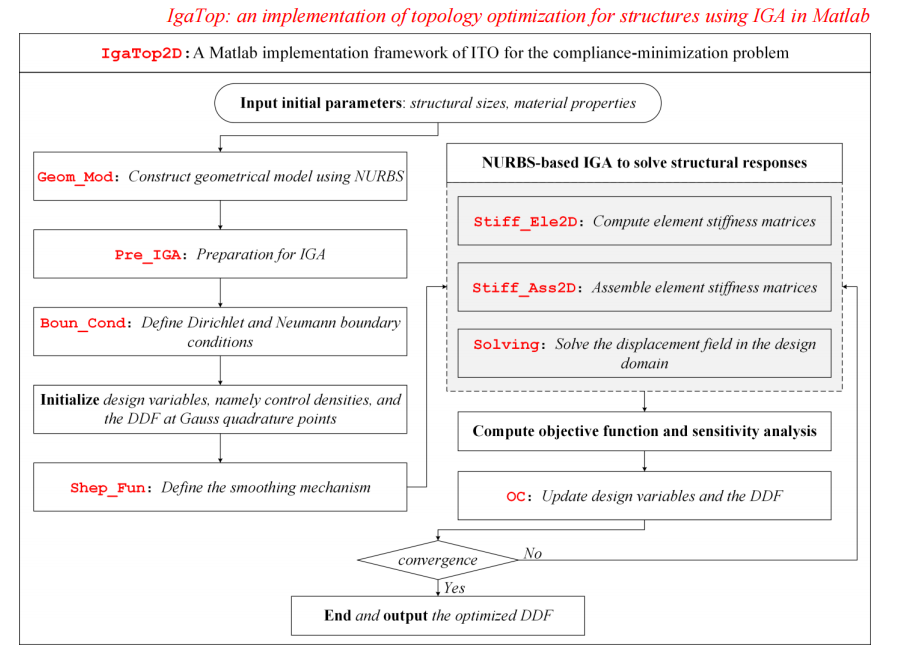
上图为使用 IGA 实现拓扑优化的整体框架流程图

### 3.1 Geom_Mod

在IGA中，二维Nurbs曲面使用如下公式表示 

$$
\mathbf{x}(\xi, \eta) = \sum_{i=1}^{n} \sum_{j=1}^{m} R_{i,j}(\xi, \eta)\, \mathbf{P}_{i,j}
$$

其中

* $R_{i,j}(\xi,\eta)$：Nurbs基函数
* $P_{i,j}$：控制点坐标

Nurbs基函数如下：

$$
R_{i,j}(\xi, \eta) = \frac{N_{i,p}(\xi)\, M_{j,q}(\eta)\, w_{i,j}}{\sum_{k=1}^{n} \sum_{l=1}^{m} N_{k,p}(\xi)\, M_{l,q}(\eta)\, w_{k,l}}
$$

* $N_{i,p}、M_{j,q}$：两个方向的B样条基函数
* $w_{i,j}$：控制点权重

对于0阶B样条基函数，有如下性质

$$
N_{i,0}(\xi) =
\begin{cases}
1, & \text{if } \xi_i \leq \xi < \xi_{i+1} \\
0, & \text{otherwise}
\end{cases}
$$

对于高阶B样条基函数，遵从下面的递归公式

$$
N_{i,p}(\xi) = \frac{\xi - \xi_i}{\xi_{i+p} - \xi_i} N_{i,p-1}(\xi)
+ \frac{\xi_{i+p+1} - \xi}{\xi_{i+p+1} - \xi_{i+1}} N_{i+1,p-1}(\xi)
$$

NURBS工具箱:

* nrbmak：基于初始结点向量和控制点构建NURBS曲面
* nrbdegelev：提升NURBS基函数在第二个参数方向上的阶数
* nrbkntins： 在初始结点向量中均匀插入一系列新结点
* nrbbasisfun：用于在指定参数位置计算非零基函数和其控制点索引。
* nrbeval: 通过参数坐标计算实际物理坐标

### 3.2 Pre_IGA

根据Nurbs曲面得出返回三个参数——[CtrPts,Ele,GauPts]

CtrPts：控制点相关信息

| 字段名              | 中文解释         |
|---------------------|--------------------------------------------------------------|
| `CtrPts.Cordis`     | 控制点在物理空间中的笛卡尔坐标，表示为 $(x, y, z, \omega)$  |
| `CtrPts.Num`        | 控制点的总数 |
| `CtrPts.NumU`       | 第一参数方向上的控制点数量   |
| `CtrPts.NumV`       | 第二参数方向上的控制点数量     |
| `CtrPts.Seque`      | 所有控制点的编号矩阵   |

Ele：IGA的单元

| 编号 | 字段名         | 含义 |
|------|----------------|------|
| 1    | `NumU`         | 第一参数方向（如 ξ）上 **IGA 元素的总数**（元素片段个数） |
| 2    | `NumV`         | 第二参数方向（如 η）上 **IGA 元素的总数** |
| 3    | `Num`          | IGA 总元素数（= `NumU × NumV`） |
| 4    | `Seque`        | 所有 IGA 元素的编号（按“左到右、下到上”的顺序）<br> |
| 5    | `KnotsU`       | 每个 IGA 元素在 **第一参数方向上的 knot 跨度（区间）** |
| 6    | `KnotsV`       | 每个 IGA 元素在 **第二参数方向上的 knot 跨度（区间）** |
| 7    | `CtrPtsNum`    | 每个元素中对其有影响的控制点数 = 非零 NURBS 基函数阶数（次数+1） |
| 8    | `CtrPtsNumU`   | 每个元素在第一参数方向上的控制点数 |
| 9    | `CtrPtsNumV`   | 每个元素在第二参数方向上的控制点数 |
| 10   | `CtrPtsCon`    | 控制点连接矩阵：第 i 行列出第 i 个元素的控制点编号（共 `CtrPtsNum` 个）<br>类似 FEM 中的 `edofMat` |
| 11   | `GauPtsNum`    | 每个元素的 **高斯积分点数量**，用于数值积分 |

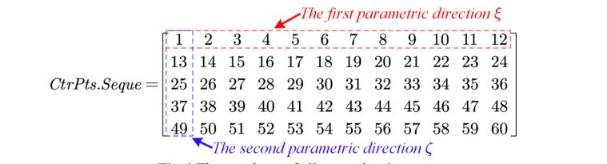

!!! warning
    其中Seque的顺序和控制点编号的顺序一致

GauPts：高斯积分点相关信息

| 字段名       | 中文解释                                     |
|--------------|----------------------------------------------|
| `QuaPts`     | 母空间中高斯积分点的坐标$(\hat{\xi}, \hat{\eta}$） |
| `Weigh`      | 每个高斯点的积分权重                         |
| `Num`        | 所有高斯积分点的总数                         |
| `CorU`       | 高斯点从母空间映射到参数空间时第一方向的 knot 对应 |
| `CorV`       | 高斯点从母空间映射到参数空间时第二方向的 knot 对应 |
| `Seque`      | 每个 IGA 元素对应的高斯点编号矩阵             |

!!! warning
    高斯积分点被定义在母空间中，需要转换到参数空间，转换如下

    $CorU = ((u2 - u1) * \hat{\xi} + (u2 + u1)) / 2$
    
    $CorV = ((v2 - v1) * \hat{\eta} + (v2 + v1)) / 2$

高斯积分点的信息通过Guadrature函数给出

``` matlab
function [quadweight, quadpoint] = Guadrature(quadorder, dim)
```

其中

* quadorder：高斯积分的阶数（例如 2阶、3阶）
* dim: 积分的维度，当前只处理了 dim = 2
* quadpoint: 高斯积分点坐标（二维）
* quadweight: 每个高斯点的积分权重

### 3.3 Boun_Cond

用于定义狄利克雷边界和纽曼边界条件

* 狄利克雷边界：固定
* 纽曼边界：载荷

``` matlab
function [DBoudary, F] = Boun_Cond(CtrPts, BoundCon, NURBS, Dofs_Num)
```

| 参数名       | 含义   |
|--------------|------------------------------------------------------------------------------------------------------|
| `CtrPts`     | 控制点信息结构体，来自 `Pre_IGA`，包含控制点坐标 `Cordis`、数量 `Num`、顺序编号 `Seque` 等，用于定义几何边界和施加载荷位置。 |
| `BoundCon`   | 整型编号，用于表示使用哪一个边界条件案例（共支持 5 种，如悬臂梁、MBB 梁、L 梁等），影响 Dirichlet/Neumann 条件的设置。 |
| `NURBS`      | NURBS 曲面结构体，包含 knot 矢量、阶数、控制点、权重等信息，是计算基函数值与导数的关键。                           |
| `Dofs.Num`   | 总自由度数量，等于控制点数 × 每个控制点的自由度（如二维问题中为 2），用于初始化力向量 `F` 的维度。                 |

### 3.4 DDF

本章用于初始化控制密度以及获取高斯积分点处的DDF(密度分布函数)

* 分配一系列定义在控制点处的离散密度，称为控制密度
* 定义平滑机制以提高控制密度的平滑度
* 将NURBS基函数（用于构建初始结构几何的NURBS曲面）与平滑后的控制密度进行线性组合，从而为整个结构几何开发相应的密度分布函数(DDF)。

其数学表达式为：

$$
\mathcal{X}(\xi, \eta) = \sum_{i=1}^{n} \sum_{j=1}^{m} R_{i,j}^{p,q}(\xi, \eta)\, \tilde{\rho}_{i,j}
$$


DDF：简单点说就是通过Nurbs基函数对控制点密度进行加权累加，得到一个光滑的密度系统，每个点的密度都可以用对应控制点密度获得

``` matlab
X.CtrPts = ones(CtrPts.Num,1); % 将所有控制点密度设置为1
GauPts.Cor = [reshape(GauPts.CorU',1,GauPts.Num);  % 组合高斯积分点的UV坐标，获取完整坐标
reshape(GauPts.CorV',1,GauPts.Num)];
[GauPts.PCor,GauPts.Pw] = nrbeval(NURBS, GauPts.Cor); % 计算高斯积分点在物理空间下的坐标
GauPts.PCor = GauPts.PCor./GauPts.Pw; % 将齐次坐标转化为非齐次坐标
[N, id] = nrbbasisfun(GauPts.Cor, NURBS); % 获取每个积分点受影响的基函数值以及控制点id
R = zeros(GauPts.Num, CtrPts.Num); % 构建一个矩阵，行数为高斯积分点数，列数为控制点数，是一个稀疏矩阵，接下来会将每个高斯积分点受影响的控制点编号存入对应的行中
for i = 1:GauPts.Num, R(i,id(i,:)) = N(i,:); end % 第i行存在阶数个控制点非0（受影响）
R = sparse(R); % 转化为稀疏矩阵
[dRu, dRv] = nrbbasisfunder(GauPts.Cor, NURBS); % 获取高斯积分点在uv方向的导数
X.GauPts = R*X.CtrPts; % 得到高斯积分点的密度
```

### 3.5 Shep_Fun

定义平滑机制

``` matlab
function [Sh, Hs] = Shep_Fun(CtrPts, rmin)
```

* 输入控制点和影响半径
* 返回加权矩阵Sh和每个控制点的加权和Hs

定义Shepard平滑函数如下：

$$
\tilde{\rho}_{i,j} = 
\sum_{i=1}^{\mathcal{N}} \sum_{j=1}^{\mathcal{M}} \psi(\rho_{i,j}) \rho_{i,j} = 
\sum_{i=1}^{\mathcal{N}} \sum_{j=1}^{\mathcal{M}} 
\left( \frac{w(\rho_{i,j})}
{\sum_{\hat{i}=1}^{\mathcal{N}} \sum_{\hat{j}=1}^{\mathcal{M}} w(\rho_{\hat{i}, \hat{j}})} \right)
\rho_{i,j}=\frac{ \sum_{i=1}^{N} \sum_{j=1}^{M} w(\rho_{i,j}) \cdot \rho_{i,j} }
     { \sum_{i=1}^{N} \sum_{j=1}^{M} w(\rho_{i,j}) }
$$

$\psi(\rho_{i,j})=\frac{w(\rho_{i,j})}
{\sum_{\hat{i}=1}^{\mathcal{N}} \sum_{\hat{j}=1}^{\mathcal{M}} w(\rho_{\hat{i}, \hat{j}})}$ 即为平滑函数


* $\rho_{i,j}$：原始控制密度
* $\tilde{\rho}_{i,j}$：平滑后的控制密度；
* $w(\rho_{i,j})$：权重函数，反映距离和影响范围

其中

$$w(v)=(1-v)^6+（35v^2+18v+3）\\ v = \frac{r}{r_{m}}
$$

* $r_m$：为影响区域的半径。
* $r$：当前控制密度与局部支撑域中其他控制密度之间的欧几里得距离

如下图所示

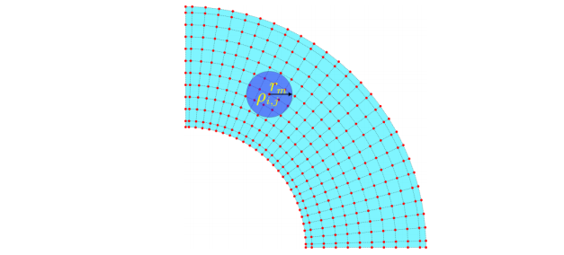


``` matlab
function [Sh, Hs] = Shep_Fun(CtrPts, rmin)
Ctr_NumU = CtrPts.NumU; Ctr_NumV = CtrPts.NumV; % 控制点数量
iH = ones(Ctr_NumU*Ctr_NumV*(2*(ceil(rmin)-1)+1)^2,1); % 所有的控制点数量*预估每个控制点影响的控制点数量即为维度（预估非0元素的个数）
jH = ones(size(iH)); sH = zeros(size(iH)); % sH为值，iH和jH为非0元素矩阵下标
k = 0;
for j1 = 1:Ctr_NumV
    for i1 = 1:Ctr_NumU
        e1 = (j1-1)*Ctr_NumU+i1; % 对当前控制点，遍历半径rmin内的所有控制点
        for j2 = max(j1-(ceil(rmin)-1),1):min(j1+(ceil(rmin)-1),Ctr_NumV)
            for i2 = max(i1-(ceil(rmin)-1),1):min(i1+(ceil(rmin)-1),Ctr_NumU)
                e2 = (j2-1)*Ctr_NumU+i2;
                k = k+1;
                iH(k) = e1;
                jH(k) = e2;
                theta = sqrt((j1-j2)^2+(i1-i2)^2)./rmin/sqrt(2); % 计算上面的v，即距离/半径
                sH(k) = (max(0, (1-theta)).^6).*(35*theta.^2 + 18*theta + 3); % 计算权重
            end
        end
    end
end
Sh = sparse(iH,jH,sH); Hs = sum(Sh,2); % 生成对应的权重矩阵，对权重矩阵的每一行累加得到对应控制点权重和
end
```

### 3.6 structural responses

本章用于求解结构响应，分为三个部分：Stiff_Ele2D、Stiff_Ass2D、Solving

* Stiff_Ele2D：计算所有等几何分析单元的刚度矩阵
* Stiff_Ass2D：组装所有等几何分析单元刚度矩阵
* Solving：解决结构响应问题

**Stiff_Ele2D**：

等几何分析单元刚度矩阵计算如下

$$
K_e = \int_{\Omega_e} B^T D B \, d\Omega_e
$$

需要使用高斯积分计算，由于高斯积分被定义在母空间中，故需要进行母空间->参数空间的映射，通过构建雅可比矩阵实现，如下式：

$$
K_e = \int_{\tilde{\Omega}_e} B^T D B |J_1||J_2| \, d\tilde{\Omega}_e
$$

$|J_1|、|J_2|$分别是x和y方向的雅可比矩阵

``` matlab
[KE, dKE, dv_dg] = Stiff_Ele2D(X, penal, Emin, DH, CtrPts, Ele, GauPts, dRu, dRv);
```

| 参数   | 含义 |
|--------|------|
| `X`    | 结构体数组，包含设计变量密度的信息。具体包含：<br> - `CtrPts`（控制点密度）<br> - `GauPts`（高斯积分点密度）<br> - `DDF`（设计域中的密度场） |
| `penal` | 惩罚参数，SIMP模型中通常取3，用于控制材料插值的非线性。 |
| `Emin`  | 空材料的最小杨氏模量，避免数值奇异性。 |
| `DH`    | 材料本构矩阵D（如平面应力或应变条件下的弹性矩阵）。 |
| `CtrPts` | 控制点信息（NURBS控制点）。 |
| `Ele`   | 等几何单元 |
| `GauPts` | 高斯积分点的位置和权重。 |
| `dRu`   | NURBS基函数对第一个参数方向（u）的导数。 |
| `dRv`   | NURBS基函数对第二个参数方向（v）的导数。 |

参数空间->物理空间的雅可比矩阵推导如下：

根据定义

$$
\mathbf{J} = 
\frac{\partial (x, y)}{\partial (\xi, \eta)} = 
\begin{bmatrix}
\frac{\partial x}{\partial \xi} & \frac{\partial x}{\partial \eta} \\
\frac{\partial y}{\partial \xi} & \frac{\partial y}{\partial \eta}
\end{bmatrix}
$$

上式的x是高斯点的x，不是控制点，根据下式可知，高斯点的坐标是由控制点插值得到

$$
\mathbf{x} = 
\begin{bmatrix}
x \\
y
\end{bmatrix}
=
\sum_{i=1}^{n} N_i(\xi, \eta) 
\begin{bmatrix}
x_i \\
y_i
\end{bmatrix}
$$

故每个元素对参数坐标的导数如下

$$
\frac{\partial x}{\partial \xi} = \sum_{i=1}^{n} \frac{\partial N_i}{\partial \xi} \cdot x_i
$$

$$
\frac{\partial x}{\partial \eta} = \sum_{i=1}^{n} \frac{\partial N_i}{\partial \eta} \cdot x_i
$$

$$
\frac{\partial y}{\partial \xi} = \sum_{i=1}^{n} \frac{\partial N_i}{\partial \xi} \cdot y_i
$$

$$
\frac{\partial y}{\partial \eta} = \sum_{i=1}^{n} \frac{\partial N_i}{\partial \eta} \cdot y_i
$$

带入J可知

$$
\mathbf{J} =
\begin{bmatrix}
\frac{\partial N_1}{\partial \xi} & \cdots & \frac{\partial N_n}{\partial \xi} \\
\frac{\partial N_1}{\partial \eta} & \cdots & \frac{\partial N_n}{\partial \eta}
\end{bmatrix}
\cdot
\begin{bmatrix}
x_1 & y_1 \\
x_2 & y_2 \\
\vdots & \vdots \\
x_n & y_n
\end{bmatrix}
$$

体现在代码中只有两行

```matlab
dPhy_dPara = dR_dPara*Ele_CoCtPt';    % phy表示物理坐标，Para表示参数坐标，R表示基函数           
J1 = dPhy_dPara;                                   
```

接下来为了计算位移-应变矩阵B，需要基函数对物理坐标的导数，使用链式法则如下：

$$
\frac{\partial N}{\partial x} = 
\frac{\partial N}{\partial \xi} \cdot \frac{\partial \xi}{\partial x} + 
\frac{\partial N}{\partial \eta} \cdot \frac{\partial \eta}{\partial x}
$$

$$
\frac{\partial N}{\partial y} = 
\frac{\partial N}{\partial \xi} \cdot \frac{\partial \xi}{\partial y} + 
\frac{\partial N}{\partial \eta} \cdot \frac{\partial \eta}{\partial y}
$$

转变为矩阵形式：

$$
\begin{bmatrix}
\frac{\partial N}{\partial x} \\
\frac{\partial N}{\partial y}
\end{bmatrix}
=
\begin{bmatrix}
\frac{\partial \xi}{\partial x} & \frac{\partial \eta}{\partial x} \\
\frac{\partial \xi}{\partial y} & \frac{\partial \eta}{\partial y}
\end{bmatrix}
\cdot
\begin{bmatrix}
\frac{\partial N}{\partial \xi} \\
\frac{\partial N}{\partial \eta}
\end{bmatrix}
$$

可以发现

$$
\mathbf{J}_1 = 
\frac{\partial (x, y)}{\partial (\xi, \eta)}
\implies
\mathbf{J}_1^{-1} = 
\frac{\partial (\xi, \eta)}{\partial (x, y)}
$$

故

$$
\begin{bmatrix}
\frac{\partial N}{\partial x} \\
\frac{\partial N}{\partial y}
\end{bmatrix}
=
\mathbf{J}_1^{-1} \cdot
\begin{bmatrix}
\frac{\partial N}{\partial \xi} \\
\frac{\partial N}{\partial \eta}
\end{bmatrix}
$$

在代码中体现如下

``` matlab
dR_dPhy = inv(J1)*dR_dPara; 
```

从母空间到参数空间的转换如下：

$$
\begin{bmatrix}
u \\
v
\end{bmatrix}
=
\begin{bmatrix}
\frac{u_{\text{max}} - u_{\text{min}}}{2} & 0 \\
0 & \frac{v_{\text{max}} - v_{\text{min}}}{2}
\end{bmatrix}
\begin{bmatrix}
\xi \\
\eta
\end{bmatrix}
+
\begin{bmatrix}
\frac{u_{\text{max}} + u_{\text{min}}}{2} \\
\frac{v_{\text{max}} + v_{\text{min}}}{2}
\end{bmatrix}
$$

故雅可比矩阵$J_2$为

$$
J_2 = 
\frac{\partial(u, v)}{\partial(\xi, \eta)} =
\begin{bmatrix}
\frac{u_{\text{max}} - u_{\text{min}}}{2} & 0 \\
0 & \frac{v_{\text{max}} - v_{\text{min}}}{2}
\end{bmatrix}
$$


整体代码注释如下：

``` matlab
function [KE, dKE, dv_dg] = Stiff_Ele2D(X, penal, Emin, DH, CtrPts, Ele, GauPts, dRu, dRv)
% 计算二维等几何单元的刚度矩阵，刚度矩阵对密度的导数，以及体积对密度的导数

% 初始化输出变量
KE = cell(Ele.Num, 1);             % 存储每个单元的刚度矩阵
dKE = cell(Ele.Num, 1);            % 存储每个单元刚度矩阵对密度的导数
dv_dg = zeros(GauPts.Num, 1);      % 存储每个高斯点的体积对密度的导数

Nen = Ele.CtrPtsNum;               % 每个单元对应的控制点数量（自由度=2*Nen）

% 遍历每个单元
for ide = 1:Ele.Num
    
    % 获取当前单元在参数空间U和V方向的索引
    [idv, idu] = find(Ele.Seque == ide);
    
    % 获取当前单元在U方向的节点区间
    Ele_Knot_U = Ele.KnotsU(idu, :);
    
    % 获取当前单元在V方向的节点区间
    Ele_Knot_V = Ele.KnotsV(idv, :);
    
    % 获取当前单元对应的控制点编号
    Ele_NoCtPt = Ele.CtrPtsCon(ide, :);
    
    % 获取当前单元控制点的物理坐标（二维）
    Ele_CoCtPt = CtrPts.Cordis(1:2, Ele_NoCtPt);
    
    % 初始化当前单元的刚度矩阵（2*Nen × 2*Nen）
    Ke = zeros(2*Nen, 2*Nen);
    
    % 初始化当前单元的刚度矩阵对每个高斯点密度的导数（cell存储）
    dKe = cell(Ele.GauPtsNum, 1);
    
    % 遍历当前单元内的所有高斯积分点
    for i = 1:Ele.GauPtsNum
        
        % 获取当前高斯点的全局编号
        GptOrder = GauPts.Seque(ide, i);
        
        % 获取当前高斯点的基函数对参数空间（ξ,η）的导数
        dR_dPara = [dRu(GptOrder, :); dRv(GptOrder, :)];
        
        % 计算雅可比矩阵 J1（从参数空间映射到物理空间）
        dPhy_dPara = dR_dPara * Ele_CoCtPt';
        J1 = dPhy_dPara;
        
        % 计算基函数对物理空间（x,y）的导数
        dR_dPhy = inv(J1) * dR_dPara;
        
        % 构建应变-位移矩阵Be
        Be(1, 1:Nen) = dR_dPhy(1, :);            % εx 对x方向位移的偏导
        Be(2, Nen+1:2*Nen) = dR_dPhy(2, :);      % εy 对y方向位移的偏导
        Be(3, 1:Nen) = dR_dPhy(2, :);            % γxy 对x方向位移的y偏导
        Be(3, Nen+1:2*Nen) = dR_dPhy(1, :);      % γxy 对y方向位移的x偏导
        
        % 计算参数空间（ξ,η）到父单元空间（[-1,1]）的缩放矩阵
        dPara_dPare(1, 1) = (Ele_Knot_U(2) - Ele_Knot_U(1)) / 2;
        dPara_dPare(2, 2) = (Ele_Knot_V(2) - Ele_Knot_V(1)) / 2;
        J2 = dPara_dPare;
        
        % 完整的Jacobian，从父单元空间到物理空间
        J = J1 * J2;
        
        % 当前高斯点的积分权重（Jacobian行列式 * 高斯点权重）
        weight = GauPts.Weigh(i) * det(J);
        
        % 材料插值（SIMP），计算当前高斯点的有效杨氏模量
        E_effective = Emin + X.GauPts(GptOrder, :).^penal * (1 - Emin);
        
        % 当前高斯点对刚度矩阵的贡献
        Ke = Ke + E_effective * weight * (Be' * DH * Be);
        
        % 当前高斯点刚度矩阵对密度的导数（灵敏度）
        dKe{i} = (penal * X.GauPts(GptOrder, :).^(penal - 1) * (1 - Emin)) * weight * (Be' * DH * Be);
        
        % 当前高斯点体积对密度的导数（Jacobian行列式 * 权重）
        dv_dg(GptOrder) = weight;
    end
    
    % 存储当前单元的刚度矩阵和导数
    KE{ide} = Ke;
    dKE{ide} = dKe;
end

end

```

**Stiff_Ass2D**

函数接口如下：

组装所有的局部刚度矩阵

``` matlab
function [K] = Stiff_Ass2D(KE, CtrPts, Ele, Dim, Dofs_Num)
```

| 变量名     | 含义说明                                           |
|------------|----------------------------------------------------|
| `KE`       | 每个单元的局部刚度矩阵（cell数组）                |
| `CtrPts`   | 控制点结构体，含有总数 `CtrPts.Num`               |
| `Ele`      | 单元结构体，包含每个单元关联的控制点编号等信息   |
| `Dim`      | 空间维度（通常为2，表示二维问题）                 |
| `Dofs_Num` | 全局自由度总数（= 控制点个数 × 维度）             |


整体代码注释如下：

``` matlab
% 初始化稀疏矩阵三元组格式的行列索引和数值（提前分配空间，防止动态扩展）
II = zeros(Ele.Num * Dim * Ele.CtrPtsNum * Dim * Ele.CtrPtsNum, 1); % 行索引
JJ = II;              % 列索引
KX = II;              % 值
ntriplets = 0;        % 三元组的计数器

% 遍历每个单元进行刚度矩阵装配
for ide = 1:Ele.Num
    Ele_NoCtPt = Ele.CtrPtsCon(ide,:);     % 当前单元对应的控制点编号
    edof = [Ele_NoCtPt, Ele_NoCtPt + CtrPts.Num]; 
    % 每个控制点在二维平面上有两个自由度（x, y），
    % edof的行数为1
    % 第一个一半是x方向，自由度编号为原编号
    % 第二个一半是y方向，自由度编号偏移CtrPts.Num

    % 遍历当前单元局部刚度矩阵的每个元素（按行列）
    for krow = 1:numel(edof)
        for kcol = 1:numel(edof)
            ntriplets = ntriplets + 1;             % 当前三元组编号加一
            II(ntriplets) = edof(krow);            % 全局行号
            JJ(ntriplets) = edof(kcol);            % 全局列号
            KX(ntriplets) = KE{ide}(krow, kcol);   % 值：来自当前单元的刚度矩阵条目
        end
    end
end

% 将三元组数据转换为稀疏矩阵
K = sparse(II, JJ, KX, Dofs_Num, Dofs_Num);

% 保证刚度矩阵对称性（修正数值误差），强制对称化
K = (K + K') / 2;
end

```

!!! warning
    全局刚度矩阵的规模为 $自由度 \times 控制点个数 \times自由度 |times 控制点个数$，sparse会自动将相同行列的下标处的值相加，刚度矩阵表示的是控制点自由度间的传递关系

**solving**

函数接口如下：

求解器，根据 $U=K/F$求解全局位移

``` matlab
function U = Solving(CtrPts, DBoudary, Dofs, K, F, BoundCon)
```

| 参数名   | 说明                                       |
|-------------|--------------------------------------------|
| `CtrPts`    | 控制点信息，包括控制点总数 `CtrPts.Num` 等 |
| `DBoudary`  | 边界条件信息，包含被固定的控制点编号       |
| `Dofs`      | 自由度信息，含总自由度数 `Dofs.Num`、固定自由度等 |
| `K`         | 全局刚度矩阵，大小为 `2N × 2N`，其中 N 为控制点数 |
| `F`         | 全局载荷向量，大小为 `2N × 1`              |
| `BoundCon`  | 边界条件编号，表示具体结构问题类型         |
| **输出参数**|              |                                            |
| `U`         | 全局自由度的位移解，大小为 `2N × 1`        |


整体代码注释如下：

``` matlab
function U = Solving(CtrPts, DBoudary, Dofs, K, F, BoundCon)
% 输入参数：
% CtrPts：控制点结构体，包含控制点数量信息
% DBoudary：包含固定控制点编号的信息（边界条件）
% Dofs：自由度结构体，含总自由度数等
% K：全局刚度矩阵（2N×2N）
% F：全局载荷向量
% BoundCon：边界条件编号（表示哪种结构问题）
% 输出：
% U：所有自由度的位移解

switch BoundCon
    case {1, 4, 5}  % 情况1、4、5：固定边界在同一组控制点上
        U_fixeddofs = DBoudary.CtrPtsOrd;                  % 获取x方向固定自由度编
        V_fixeddofs = DBoudary.CtrPtsOrd + CtrPts.Num;     % y方向编号在x方向基础上偏移CtrPts.Num
    case {2, 3}     % 情况2、3：边界可能在两个不同位置
        U_fixeddofs = DBoudary.CtrPtsOrd1;                 % x方向固定控制点编号
        V_fixeddofs = [DBoudary.CtrPtsOrd1; DBoudary.CtrPtsOrd2] + CtrPts.Num;
        % y方向包含两个部分，编号加偏移
end

Dofs.Ufixed = U_fixeddofs;           % 存储x方向固定自由度
Dofs.Vfixed = V_fixeddofs;           % 存储y方向固定自由度

Dofs.Free = setdiff(1:Dofs.Num, [Dofs.Ufixed; Dofs.Vfixed]);
% 所有自由度编号为1~2N，从中移除固定自由度，得到自由自由度编号列表

U = zeros(Dofs.Num, 1);              % 初始化全局位移向量，所有自由度初值为0

% 求解线性系统：仅在自由自由度上求解 K·U = F
% 固定自由度的位移为0（默认），求解剩余自由度对应的位移
U(Dofs.Free) = K(Dofs.Free, Dofs.Free) \ F(Dofs.Free);
end
```

### 3.7 sensitivity analysis

本章进行灵敏度分析

下式为目标函数对DDF的导数

$$
\begin{cases}
\frac{\partial J}{\partial \mathcal{X}} = -\frac{1}{2} \int_{\Omega} \varepsilon(\mathbf{u})^T \left( \gamma \mathcal{X}^{\gamma - 1} \mathbf{D}_0 \right) \varepsilon(\mathbf{u}) \, d\Omega \\
\frac{\partial G}{\partial \mathcal{X}} = \frac{1}{|\Omega|} \int_{\Omega} v_0 \, d\Omega
\end{cases}
$$

由于DDF是由平滑后的密度值插值得到的（由4.5章可知），

$$
\mathcal{X}(\xi,\eta) = \sum_{i,j} R^{p,q}_{i,j}(\xi,\eta) \cdot \tilde{\rho}_{i,j}
$$

故通过链式法则DDF对原密度值通过有如下表达式：

$$
\frac{\partial \mathcal{X}}{\partial \rho_{i,j}} = \frac{\partial \mathcal{X}}{\partial \tilde{\rho}_{i,j}} \cdot \frac{\partial \tilde{\rho}_{i,j}}{\partial \rho_{i,j}} = R^{p,q}_{i,j}(\xi,\eta) \cdot \psi(\rho_{i,j})
$$

则最终目标函数对设计变量的表达式如下：

$$
\begin{cases}
\frac{\partial J}{\partial \rho_{i,j}} = -\frac{1}{2} \int_{\Omega} \varepsilon(\mathbf{u})^T \gamma \mathcal{X}^{\gamma - 1} R^{p,q}_{i,j}(\xi,\eta) \psi(\rho_{i,j}) \mathbf{D}_0 \varepsilon(\mathbf{u}) \, d\Omega \\
\frac{\partial G}{\partial \rho_{i,j}} = \frac{1}{|\Omega|} \int_{\Omega} R^{p,q}_{i,j}(\xi,\eta) \psi(\rho_{i,j}) v_0 \, d\Omega
\end{cases}
$$

整体代码注释如下：

对于体积对设计变量的导数

$$
\frac{\partial G}{\partial \rho_{i,j}} = \frac{1}{|\Omega|} \int_{\Omega} v_0 \, d\Omega = \frac{1}{|\Omega|} \int_{\Omega} \frac{\partial \mathcal{X}(\xi, \eta)}{\partial \rho_{i,j}} \, d\Omega 
$$

而由上面推导可知：

$$
\frac{\partial \mathcal{X}(\xi, \eta)}{\partial \rho_{i,j}} = R^{p,q}_{i,j}(\xi, \eta) \cdot \psi(\rho_{i,j})
$$

故

$$
\frac{\partial G}{\partial \rho_{i,j}} = \frac{1}{|\Omega|} \int_{\Omega} R^{p,q}_{i,j}(\xi, \eta) \cdot \psi(\rho_{i,j}) \, d\Omega
$$

``` matlab
%% Objective function and sensitivity analysis
J = 0;                                % 初始化目标函数（结构柔度）
dJ_dg = zeros(GauPts.Num,1);         % 初始化目标函数对高斯点密度的灵敏度向量

for ide = 1:Ele.Num                  % 遍历所有单元
    Ele_NoCtPt = Ele.CtrPtsCon(ide,:);          % 当前单元对应的控制点编号
    edof = [Ele_NoCtPt, Ele_NoCtPt + CtrPts.Num]; % 当前单元自由度编号（x方向 + y方向）

    Ue = U(edof,1);                  % 提取当前单元对应的位移向量（长度为2×控制点个数）

    J = J + Ue' * KE{ide} * Ue;      % 柔度目标函数累加：J += u_e^T * K_e * u_e

    for i = 1:Ele.GauPtsNum          % 遍历该单元包含的所有高斯点
        GptOrder = GauPts.Seque(ide, i);    % 获取该高斯点在全局高斯点序列中的编号
        dJ_dg(GptOrder) = -Ue' * dKE{ide}{i} * Ue;  
        % 计算目标函数对该高斯点密度的导数（灵敏度项）
        % ∂J/∂g_i = -u_e^T * ∂K_e/∂g_i * u_e
    end
end

dJ_dp = R' * dJ_dg;                  % 将高斯点上的灵敏度通过基函数投影回控制点：dJ/dρ
dJ_dp = Sh * (dJ_dp ./ Hs);         % 使用 Shepard 权重对控制点导数进行平滑处理，减少震荡

dv_dp = R' * dv_dg;                 % 同理，将体积约束导数从高斯点投影回控制点
dv_dp = Sh * (dv_dp ./ Hs);         % 对体积导数进行平滑处理
```

### 3.8 OC法

函数接口：

``` matlab
function X = OC(X, R, Vmax, Sh, Hs, dJ_dp, dv_dp)
```

| 参数名       | 含义                                                         |
|--------------|--------------------------------------------------------------|
| `X.CtrPts`   | 控制点处的当前密度（设计变量），为列向量                    |
| `R`          | NURBS 基函数矩阵，用于将控制点密度映射到高斯点密度         |
| `Vmax`       | 最大允许体积分数（约束材料使用量）                           |
| `Sh`         | Shepard 平滑矩阵，用于平滑设计变量                           |
| `Hs`         | Shepard 平滑归一化因子，避免除以0                            |
| `dJ_dp`      | 目标函数对控制点密度的导数（柔度灵敏度）                    |
| `dv_dp`      | 体积约束函数对控制点密度的导数（体积灵敏度）                |


函数整体注释如下：

``` matlab
function X = OC(X, R, Vmax, Sh, Hs, dJ_dp, dv_dp)

% 初始化拉格朗日乘子的搜索范围 [l1, l2]
% move 是设计变量最大变化幅度（防止变化过快）
l1 = 0; l2 = 1e9; move = 0.2;

while (l2-l1)/(l1+l2) > 1e-3
    lmid = 0.5*(l2+l1);
    % OC 更新核心公式：
    % 更新控制点密度变量，限制在 [ρ - move, ρ + move] 内，并保持在 [0, 1]
    X.CtrPts_new = max(0,max(X.CtrPts-move,min(1,min(X.CtrPts+move,X.CtrPts.*sqrt(-dJ_dp./dv_dp/lmid)))));
    % 对更新后的设计变量进行 Shepard 平滑处理
    X.CtrPts_new = (Sh*X.CtrPts_new)./Hs;
    % 将新的控制点密度投影到高斯点密度
    X.GauPts = R*X.CtrPts_new;
    % 判断当前平均密度是否超过最大体积分数
    if mean(X.GauPts(:)) > Vmax
        l1 = lmid;
    else
        l2 = lmid;
    end
end
end
```

### 3.9 Plot_Data and Plot_Topy

Plot_Data：生成用于绘图的图像窗口布局参数（Pos），计算用于绘图的密度场坐标网格（DenFied）

``` matlab
function [DenFied, Pos] = Plot_Data(Num, NURBS)
```

| 参数名     | 类型     | 含义说明                                                       |
|------------|----------|----------------------------------------------------------------|
| `Num`      | 向量     | NURBS 网格在两个方向的单元数量，如 `[20, 5]` 表示 20×5 网格    |
| `NURBS`    | 结构体   | NURBS 几何结构，包含控制点、阶数、节点矢量等                  |
| `DenFied`  | 结构体   | 绘图所需的密度场数据，包括基函数、物理坐标网格等              |
| `Pos`      | 结构体   | 图像窗口位置参数，用于多子图布局（`p1` 到 `p4`）               |


Plot_Topy：等几何拓扑优化结果的可视化函数，绘制了设计变量分布、密度场和结构拓扑图等图形。

``` matlab
function [X] = Plot_Topy(X, GauPts, CtrPts, DenFied, L, W, Pos)
```


| 参数名       | 类型       | 说明                                                         |
|--------------|------------|--------------------------------------------------------------|
| `X`          | 结构体     | 包含控制点密度 `CtrPts`、高斯点密度 `GauPts`、输出 DDF 等   |
| `GauPts`     | 结构体     | 高斯点的物理坐标 `PCor` 等                                 |
| `CtrPts`     | 结构体     | 控制点坐标 `Cordis`，数量等                                 |
| `DenFied`    | 结构体     | 绘图密度场所需信息，包括 `Ux`, `Uy`, `N`, `id`              |
| `L`          | 数值       | 结构在 X 方向的长度（用于设定绘图坐标轴范围）              |
| `W`          | 数值       | 结构在 Y 方向的宽度                                         |
| `Pos`        | 结构体     | 图形窗口的布局位置（由 `Plot_Data` 函数生成）              |


---

## 四、实验结果

本章展示五种不同的模型，每种模型分别展示五副图，依次为：

* 控制点处的密度
* 高斯点处的密度
* 密度分布函数 DDF
* 高斯点处密度大于 0.5 的二维投影
* DDF 的等值线，近似表示结构拓扑边界

### 4.1 悬臂梁

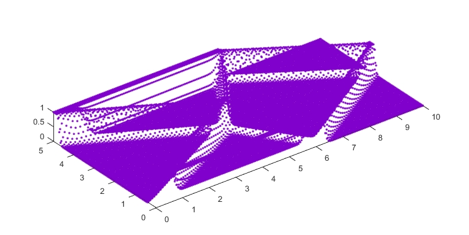
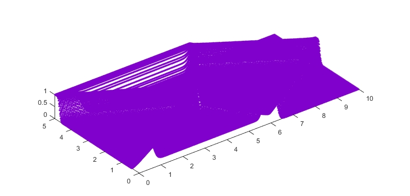
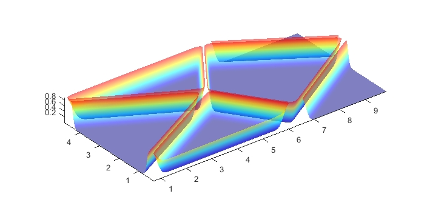
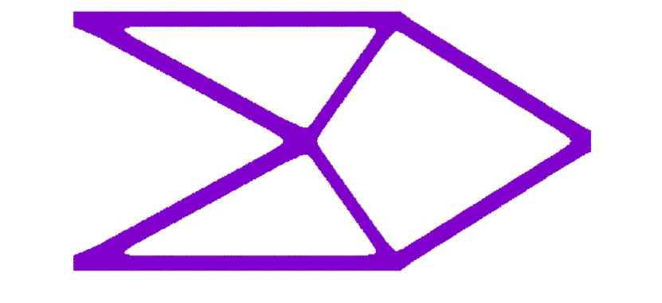


### 4.2 MBB梁

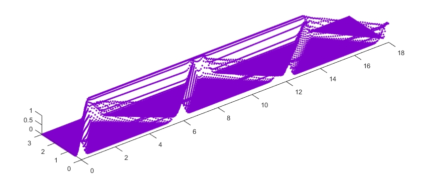
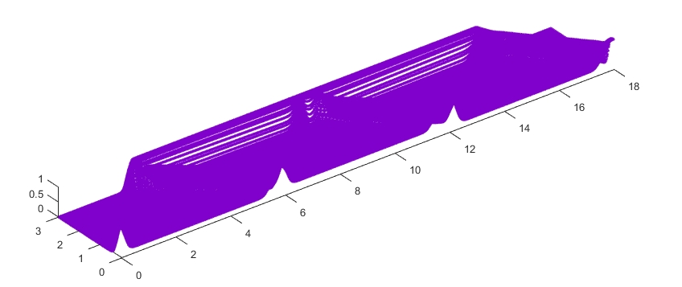
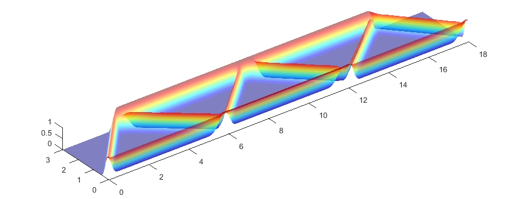
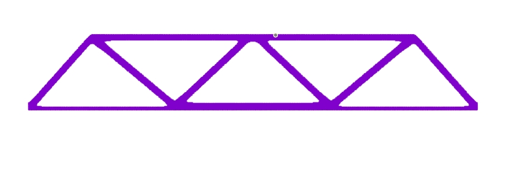


### 4.3 Michell 型结构

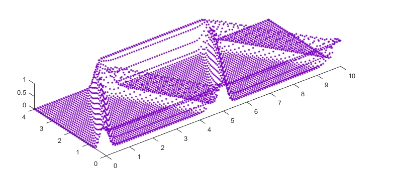
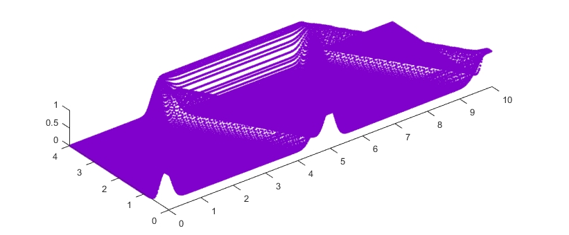
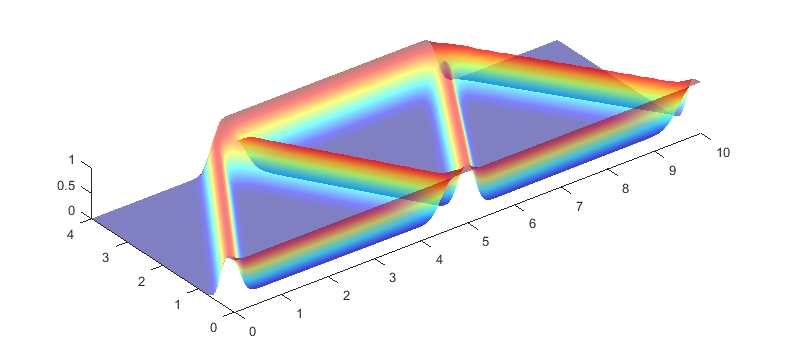
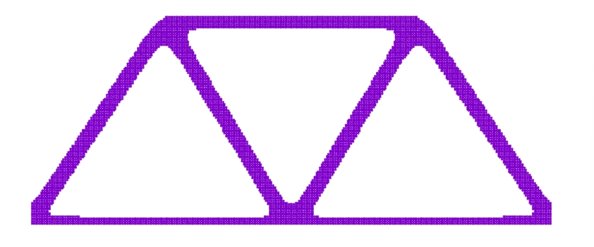
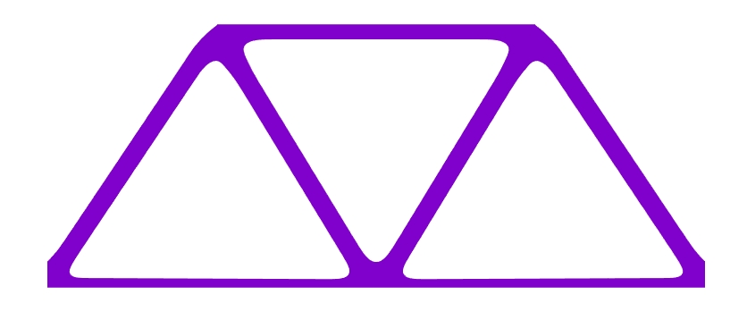

### 4.4 L 型梁

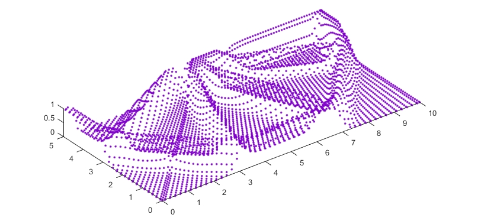
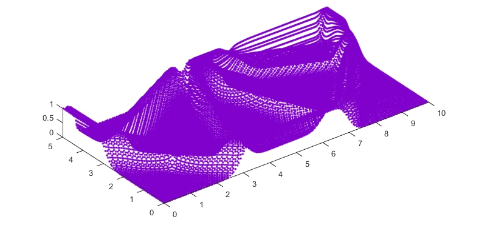
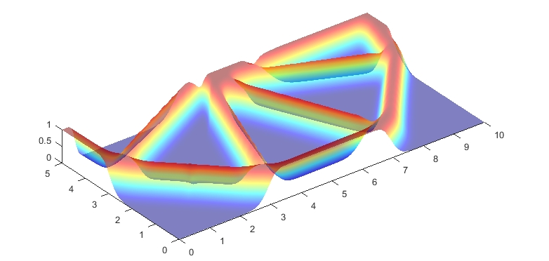


### 4.5 四分之一圆环

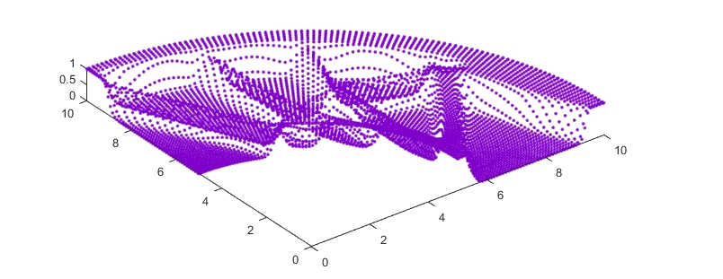
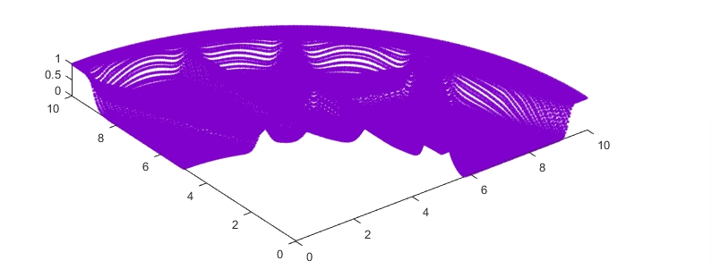
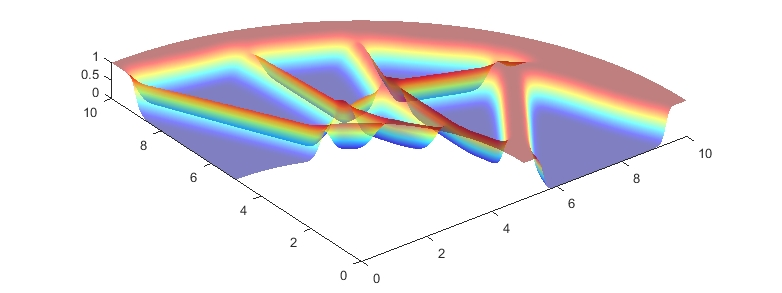

