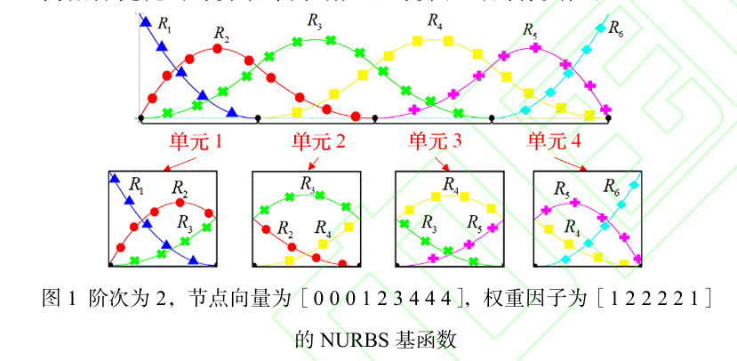

# 等几何拓扑优化高效隐式过滤方法
[论文地址](../source/等几何拓扑优化高效隐式过滤方法.pdf)

## 一、概述

### 1.1 目的

无论是B样条还是NURBS隐式过滤方法，其基函数空间具有非单元一致性，每个参数单
元中心点处的基函数值及其索引均需计算和保存，降低了等几何拓扑优化的计算效率并增大了计算机的内存负担。

Bernstein基函数具有单元局部基函数空间一致的特点，故该论文提出将NURBS基函数值的存储等价转换为单个单元Bernstein基函数值和所有参数方向Bézier提取矩阵的存储

### 1.1 Bézier分解算法

在节点矢量上不断插入节点，直到内部节点的重复度达到 𝑝−1,以此将 B 样条基函数拆分为 Bézier 基函数片段。

