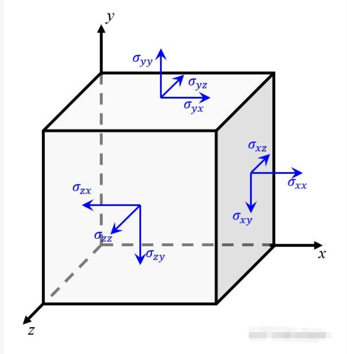

# 弹性力学相关基础知识

## 本构矩阵/应力/应变/泊松比

内容来自**文末的博客**，写的很好，很推荐阅读

第一篇博客讲了什么是张量，以二阶张量为例，将一个二阶张量理解成二维矩阵是不准确的，张量有大小和方向。

在三维笛卡尔坐标系下，应力张量可以写成如下形式：

$$
\sigma_{ij} =
\begin{bmatrix}
\sigma_{xx} & \sigma_{xy} & \sigma_{xz} \\
\sigma_{yx} & \sigma_{yy} & \sigma_{yz} \\
\sigma_{zx} & \sigma_{zy} & \sigma_{zz}
\end{bmatrix}
$$

上式中主对角元上的三个分量可以理解为在分别在三个坐标轴对应的法平面上的单位面积沿着三个坐标轴方向上的力，而非对角元上的分量则表示在法平面上的单位面积沿着其他方向的力，它会使得单元体在这个方向上发生错位，因此被称为切应力，如下图所示。

应变张量也是如此，正应变，$\epsilon_{xx}$表示的是单元体沿着x方向上单位长度在x方向的形变量,可以理解为单元体在某个方向上拉伸或者压缩变形相对于初始尺寸的比例。剪应变，例如$\epsilon_{xy}$表示的是单元体沿着x方向上单位长度在y方向的形变量

!!! warning
    这里的剪应变和材料力学中的剪应变  $\gamma_{ij}$的关系为 $\gamma_{ij}=2\epsilon_{ij}$

对于弹性张量(本构矩阵)，是建立应力张量和应变张量之间的联系的，其中弹性张量的前两个指标由应力确定，后两个指标由应变确定。可以看作是应变 $/epsilon_{kl}$ 对应力 $\delta_{ij}$的影响程度，在笛卡尔坐标系下 

$$
\sigma_{xx} = D_{xxxx} \varepsilon_{xx} + D_{xxxy} \varepsilon_{xy} + D_{xxxz} \varepsilon_{xz}
+ D_{xxyx} \varepsilon_{yx} + D_{xxyy} \varepsilon_{yy} + D_{xxyz} \varepsilon_{yz} \\
\quad + D_{xxzx} \varepsilon_{zx} + D_{xxzy} \varepsilon_{zy} + D_{xxzz} \varepsilon_{zz}
$$

则原本的本构矩阵D应为 $9 \times 9$的矩阵

$$
\begin{Bmatrix}
\sigma_{xx} \\
\sigma_{yy} \\
\sigma_{zz} \\
\sigma_{xy} \\
\sigma_{yz} \\
\sigma_{zx} \\
\sigma_{yx} \\
\sigma_{zy} \\
\sigma_{xz}
\end{Bmatrix}
=
\begin{bmatrix}
D_{xxxx} & D_{xxyy} & D_{xxzz} & D_{xxxy} & D_{xxyz} & D_{xxxz} & D_{xxyx} & D_{xxzy} & D_{xxzx} \\
D_{yyxx} & D_{yyyy} & D_{yyzz} & D_{yyxy} & D_{yyyz} & D_{yyxz} & D_{yyyx} & D_{yyzy} & D_{yyzx} \\
D_{zzxx} & D_{zzyy} & D_{zzzz} & D_{zzxy} & D_{zzyz} & D_{zzxz} & D_{zzyx} & D_{zzzy} & D_{zzzx} \\
D_{xyxx} & D_{xyyy} & D_{xyzz} & D_{xyxy} & D_{xyyz} & D_{xyxz} & D_{xyyx} & D_{xyzy} & D_{xyzx} \\
D_{yzxx} & D_{yzyy} & D_{yzzz} & D_{yzxy} & D_{yzyz} & D_{yzxz} & D_{yzyx} & D_{yzzy} & D_{yzzx} \\
D_{zxxx} & D_{zxyy} & D_{zxzz} & D_{zxxy} & D_{zxyz} & D_{zxxz} & D_{zxyx} & D_{zxzy} & D_{zxzx} \\
D_{yxxx} & D_{yxyy} & D_{yxzz} & D_{yxx y} & D_{yxyz} & D_{yxxz} & D_{yxyx} & D_{yxzy} & D_{yxzx} \\
D_{zyxx} & D_{zyyy} & D_{zyzz} & D_{zyxy} & D_{zyyz} & D_{zyxz} & D_{zyyx} & D_{zyzy} & D_{zyzx} \\
D_{xzxx} & D_{xzyy} & D_{xzzz} & D_{xzxy} & D_{xzyz} & D_{xzxz} & D_{xzyx} & D_{xzzy} & D_{xzzx}
\end{bmatrix}
\begin{Bmatrix}
\varepsilon_{xx} \\
\varepsilon_{yy} \\
\varepsilon_{zz} \\
\varepsilon_{xy} \\
\varepsilon_{yz} \\
\varepsilon_{zx} \\
\varepsilon_{yx} \\
\varepsilon_{zy} \\
\varepsilon_{xz}
\end{Bmatrix}
$$

由于剪应力互等， $\delta_{ij}=\delta_{ji}$，$\epsilon_{ij}=\epsilon_{ji}$，故将对称部分合并，于是应变和应力分量变成了6个，弹性矩阵变成了 $6\times 6$形式

$$
\begin{Bmatrix}
\sigma_{xx} \\
\sigma_{yy} \\
\sigma_{zz} \\
\sigma_{xy} \\
\sigma_{yz} \\
\sigma_{zx}
\end{Bmatrix}
=
\begin{bmatrix}
D_{xxxx} & D_{xxyy} & D_{xxzz} & D_{xxxy} & D_{xxyz} & D_{xxxz} \\
D_{yyxx} & D_{yyyy} & D_{yyzz} & D_{yyxy} & D_{yyyz} & D_{yyxz} \\
D_{zzxx} & D_{zzyy} & D_{zzzz} & D_{zzxy} & D_{zzyz} & D_{zzxz} \\
D_{xyxx} & D_{xyyy} & D_{xyzz} & D_{xyxy} & D_{xyyz} & D_{xyxz} \\
D_{yzxx} & D_{yzyy} & D_{yzzz} & D_{yzyx} & D_{yzyz} & D_{yzxz} \\
D_{zxxx} & D_{zxyy} & D_{zxzz} & D_{zxxy} & D_{zxzy} & D_{zxzx}
\end{bmatrix}
\begin{Bmatrix}
\varepsilon_{xx} \\
\varepsilon_{yy} \\
\varepsilon_{zz} \\
\gamma_{xy} \\
\gamma_{yz} \\
\gamma_{zx}
\end{Bmatrix}
$$

上面为张量形式的解释，具体推导可以看第二篇博客，讲解了泊松比的概念以及本构矩阵D的推导

**泊松比**：实际是几何概念，比如拉伸一个二维实体，横向拉长的同时纵向会收缩，泊松比就是描述这种侧向变化

**胡克定律**：在一维弹性中， $\delta=E\xi$

**广义胡克定律**：多维(大于2)弹性中，会加入侧向变化（即引入泊松比），例如二维弹性问题，此时$\xi_{xx}=\frac{\delta_{xx}}{E}-v\frac{\delta_{yy}}{E}$，三维再加上$\delta_{zz}$项

* 使用应力表示应变，与后面本构矩阵推导不同，本构矩阵是使用应变表示应力
* 正应力公式（三维弹性，E为杨氏模量），后面是泊松比作用的切向变化

$$
\varepsilon_{xx} = \frac{\sigma_{xx}}{E} - \nu \cdot \frac{\sigma_{yy}}{E} - \nu \cdot \frac{\sigma_{zz}}{E}
= \frac{1}{E} \left[ \sigma_{xx} - \nu \cdot (\sigma_{yy} + \sigma_{zz}) \right]
$$

$$
\varepsilon_{yy} = \frac{\sigma_{yy}}{E} - \nu \cdot \frac{\sigma_{xx}}{E} - \nu \cdot \frac{\sigma_{zz}}{E}
= \frac{1}{E} \left[ \sigma_{yy} - \nu \cdot (\sigma_{xx} + \sigma_{zz}) \right]
$$

$$
\varepsilon_{zz} = \frac{\sigma_{zz}}{E} - \nu \cdot \frac{\sigma_{xx}}{E} - \nu \cdot \frac{\sigma_{yy}}{E}
= \frac{1}{E} \left[ \sigma_{zz} - \nu \cdot (\sigma_{xx} + \sigma_{yy}) \right]
$$

* **切应力公式**，G为弹性模量

$$
\gamma_{xy} = \frac{\delta_{xy}}{G}, \quad
\gamma_{yz} = \frac{\delta_{yz}}{G}, \quad
\gamma_{zx} = \frac{\delta_{zx}}{G}
$$

下面使用材料力学的 $\epsilon$作为应变，两者关系为 $\gamma_{xy}=2\epsilon_{xy}$

之前得出的$6\times6$本构矩阵的张量形式，对第四行展开

$$
\sigma_{xy} = [D_{xykl}] \varepsilon_{kl} =
D_{xyxx} \varepsilon_{xx} +
D_{xyyy} \varepsilon_{yy} +
D_{xyzz} \varepsilon_{zz} +
D_{xyxy} \varepsilon_{xy} +
D_{xyyz} \varepsilon_{yz} +
D_{xyzx} \varepsilon_{zx}
$$

又因为

$$
\tau_{xy} = G \gamma_{xy} = 2G \varepsilon_{xy}
$$

对比可以得出 $D_{xyxy}=2G$

同样可以得出后面三行均为2G，下面将xy替换为12进行表示

$$
\begin{Bmatrix}
\sigma_{11} \\
\sigma_{22} \\
\sigma_{33} \\
\sigma_{12} \\
\sigma_{23} \\
\sigma_{31}
\end{Bmatrix}
=
\begin{bmatrix}
D_{1111} & D_{1122} & D_{1133} & D_{1112} & D_{1123} & D_{1131} \\
D_{2211} & D_{2222} & D_{2233} & D_{2212} & D_{2223} & D_{2231} \\
D_{3311} & D_{3322} & D_{3333} & D_{3312} & D_{3323} & D_{3331} \\
0        & 0        & 0        & 2G       & 0        & 0        \\
0        & 0        & 0        & 0        & 2G       & 0        \\
0        & 0        & 0        & 0        & 0        & 2G
\end{bmatrix}
\begin{Bmatrix}
\varepsilon_{11} \\
\varepsilon_{22} \\
\varepsilon_{33} \\
\varepsilon_{12} \\
\varepsilon_{23} \\
\varepsilon_{31}
\end{Bmatrix}
$$

上面计算完了切应力，还剩下三行**正应力部分**

我们已知的广义胡克定律可以使用应力表示应变，但本构矩阵的目的是使用应变表示应力，故需要对已知的三个式子进行变换

$$
\varepsilon_{11} = \frac{1}{E} \left[ \sigma_{11} - \nu (\sigma_{22} + \sigma_{33}) \right] \\
\varepsilon_{22} = \frac{1}{E} \left[ \sigma_{22} - \nu (\sigma_{11} + \sigma_{33}) \right] \\
\varepsilon_{33} = \frac{1}{E} \left[ \sigma_{33} - \nu (\sigma_{11} + \sigma_{22}) \right]
$$

经过推导可以得出下式（具体推导见博客）

$$
\sigma_{11} = \frac{E}{1 + \nu} \varepsilon_{11} + \frac{\nu E}{(1 - 2\nu)(1 + \nu)} \varepsilon_{ii}
= \frac{E}{1 + \nu} \varepsilon_{11} + \frac{\nu E}{(1 - 2\nu)(1 + \nu)} \left( \varepsilon_{11} + \varepsilon_{22} + \varepsilon_{33} \right)
$$

稍作整理即可得出

$$
\sigma_{11} =
\left[ \frac{(1 - \nu)E}{(1 - 2\nu)(1 + \nu)} \right] \varepsilon_{11}
+ \frac{\nu E}{(1 - 2\nu)(1 + \nu)} \varepsilon_{22}
+ \frac{\nu E}{(1 - 2\nu)(1 + \nu)} \varepsilon_{33}
$$

对比张量形式 

$$
\sigma_{11} =
D_{1111} \varepsilon_{11} + D_{1122} \varepsilon_{22} + D_{1133} \varepsilon_{33}
+ D_{1112} \varepsilon_{12} + D_{1123} \varepsilon_{23} + D_{1131} \varepsilon_{31}
$$

可以发现 $\varepsilon_{12}, \varepsilon_{23}, \varepsilon_{31}$ 没有出现在上式中，说明：

$$
D_{1112} = D_{1123} = D_{1131} = 0
$$

剩余的系数为：

$$
D_{1111} = \frac{(1 - \nu)E}{(1 - 2\nu)(1 + \nu)}, \quad
D_{1122} = D_{1133} = \frac{\nu E}{(1 - 2\nu)(1 + \nu)}
$$

故**最终本构矩阵**如下：

$$
\begin{Bmatrix}
\sigma_{11} \\
\sigma_{22} \\
\sigma_{33} \\
\sigma_{12} \\
\sigma_{23} \\
\sigma_{31}
\end{Bmatrix}
=
\begin{bmatrix}
\frac{(1-\nu)E}{(1-2\nu)(1+\nu)} & \frac{\nu E}{(1-2\nu)(1+\nu)} & \frac{\nu E}{(1-2\nu)(1+\nu)} & 0 & 0 & 0 \\
\frac{\nu E}{(1-2\nu)(1+\nu)} & \frac{(1-\nu)E}{(1-2\nu)(1+\nu)} & \frac{\nu E}{(1-2\nu)(1+\nu)} & 0 & 0 & 0 \\
\frac{\nu E}{(1-2\nu)(1+\nu)} & \frac{\nu E}{(1-2\nu)(1+\nu)} & \frac{(1-\nu)E}{(1-2\nu)(1+\nu)} & 0 & 0 & 0 \\
0 & 0 & 0 & 2G & 0 & 0 \\
0 & 0 & 0 & 0 & 2G & 0 \\
0 & 0 & 0 & 0 & 0 & 2G
\end{bmatrix}
\begin{Bmatrix}
\varepsilon_{11} \\
\varepsilon_{22} \\
\varepsilon_{33} \\
\varepsilon_{12} \\
\varepsilon_{23} \\
\varepsilon_{31}
\end{Bmatrix}
$$

---

## 参考wiki

* [蓝色的破车博客](https://zhuanlan.zhihu.com/p/676670445)

* [大白话的弹性刚度矩阵推导方法](https://zhuanlan.zhihu.com/p/459350308)